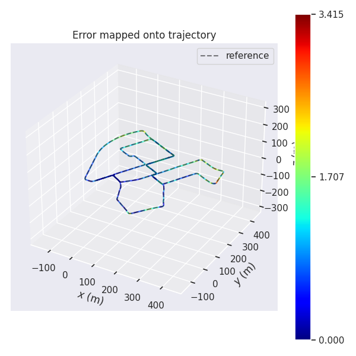
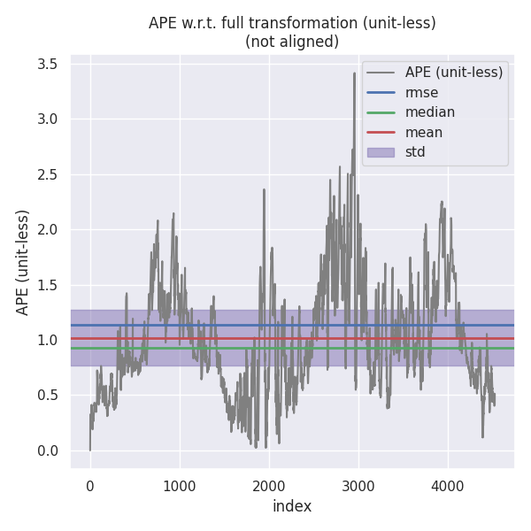

## 代码补全

激光历程因子

<table>
<tr>
  <td></td>
  <td> </td>
</tr>
<tr>
  <td></td>
  <td> </td>
</tr>
<tr>
  <td></td>
</tr>
</table>

代码实现如下

```C++
//
// TODO: get square root of information matrix:
//
Eigen::Matrix<double, 6, 6> sqrt_info = Eigen::LLT<Eigen::Matrix<double, 6, 6>>(I_).matrixL().transpose();

//
// TODO: compute residual:
//
Eigen::Map<Eigen::Matrix<double, 6, 1>> residual(residuals);
residual.block<3, 1>(INDEX_P, 0) = ori_i.inverse() * (pos_j - pos_i) - pos_ij;
residual.block<3, 1>(INDEX_R, 0) = (ori_i.inverse() * ori_j * ori_ij.inverse()).log();

//
// TODO: compute jacobians:
//
if (jacobians) {
    // compute shared intermediate results:
    const Eigen::Matrix3d R_i_inv = ori_i.inverse().matrix();
    const Eigen::Matrix3d J_r_inv = JacobianRInv(residual.block<3, 1>(INDEX_R, 0));
    const Eigen::Vector3d pos_p_ij = ori_i.inverse() * (pos_j - pos_i);

    if (jacobians[0]) {
        // implement computing:
        Eigen::Map<Eigen::Matrix<double, 6, 15, Eigen::RowMajor>> jacobian_i(jacobians[0]);
        jacobian_i.setZero();

        jacobian_i.block<3, 3>(INDEX_P, INDEX_P) = -R_i_inv;
        jacobian_i.block<3, 3>(INDEX_R, INDEX_R) = -J_r_inv;
        jacobian_i.block<3, 3>(INDEX_P, INDEX_R) = Sophus::SO3d::hat(pos_p_ij).matrix();

        jacobian_i = sqrt_info * jacobian_i;
    }

    if (jacobians[1]) {
        // implement computing:

        Eigen::Map<Eigen::Matrix<double, 6, 15, Eigen::RowMajor>> jacobian_j(jacobians[1]);
        jacobian_j.setZero();

        jacobian_j.block<3, 3>(INDEX_P, INDEX_P) = R_i_inv;
        jacobian_j.block<3, 3>(INDEX_R, INDEX_R) = J_r_inv * ori_ij.matrix();

        jacobian_j = sqrt_info * jacobian_j;
    }
}

//
// TODO: correct residual by square root of information matrix:
//

residual = sqrt_info * residual;
```

地图匹配因子

<table>
<tr>
  <td></td>
  <td> </td>
</tr>
</table>

代码实现如下:

```C++
//
// TODO: get square root of information matrix:
//
Eigen::Matrix<double, 6, 6> sqrt_info = Eigen::LLT<Eigen::Matrix<double, 6, 6>>(I_).matrixL().transpose();
//
// TODO: compute residual:
//

Eigen::Map<Eigen::Matrix<double, 6, 1>> residual(residuals);
residual.block<3, 1>(INDEX_P, 0) = pos - pos_prior;
residual.block<3, 1>(INDEX_R, 0) = (ori * ori_prior.inverse()).log();

//
// TODO: compute jacobians:
//
if (jacobians) {
    if (jacobians[0]) {
        // implement jacobian computing:
        Eigen::Map<Eigen::Matrix<double, 6, 15, Eigen::RowMajor>> jacobian_prior(jacobians[0]);
        jacobian_prior.setZero();

        jacobian_prior.block<3, 3>(INDEX_P, INDEX_P) = Eigen::Matrix3d::Identity();
        jacobian_prior.block<3, 3>(INDEX_R, INDEX_R) = JacobianRInv(residual.block<3, 1>(INDEX_R, 0)) * ori_prior.matrix();

        jacobian_prior = sqrt_info * jacobian_prior;
    }
}

//
// TODO: correct residual by square root of information matrix:
//

residual = sqrt_info * residual;
```

IMU预积分因子

<table>
<tr>
  <td></td>
  <td> </td>
</tr>
<tr>
  <td></td>
  <td> </td>
</tr>
</table>

代码如下：

```C++
//
// TODO: get square root of information matrix:
//

Eigen::Matrix<double, 15, 15> sqrt_info = Eigen::LLT<Eigen::Matrix<double, 15, 15>>(I_).matrixL().transpose();

//
// TODO: compute residual:
//
Eigen::Map<Eigen::Matrix<double, 15, 1>> residual(residuals);
residual.block<3, 1>(INDEX_P, 0) = ori_i.inverse().matrix() * (pos_j - pos_i - vel_i * T_ + 0.5 * g_ * T_ * T_) - alpha_ij;
residual.block<3, 1>(INDEX_R, 0) = (Sophus::SO3d::exp(theta_ij).inverse() * ori_i.inverse() * ori_j).log();
residual.block<3, 1>(INDEX_V, 0) = ori_i.inverse() * (vel_j - vel_i + g_ * T_) - beta_ij;
residual.block<3, 1>(INDEX_A, 0) = b_a_j - b_a_i;
residual.block<3, 1>(INDEX_G, 0) = b_g_j - b_g_i;
//
// TODO: compute jacobians:
//
if (jacobians) {
    // compute shared intermediate results:

    const Eigen::Matrix3d R_i_inv = ori_i.inverse().matrix();
    const Eigen::Matrix3d J_r_inv = JacobianRInv(residual.block<3, 1>(INDEX_R, 0));

    if (jacobians[0]) {
        Eigen::Map<Eigen::Matrix<double, 15, 15, Eigen::RowMajor>> jacobian_i(jacobians[0]);
        jacobian_i.setZero();
        // a. residual, position:
        jacobian_i.block<3, 3>(INDEX_P, INDEX_P) = -R_i_inv;
        jacobian_i.block<3, 3>(INDEX_P, INDEX_R) = Sophus::SO3d::hat(
            ori_i.inverse() * (pos_j - pos_i - vel_i * T_ + 0.50 * g_ * T_ * T_));
        jacobian_i.block<3, 3>(INDEX_P, INDEX_V) = -T_ * R_i_inv;
        jacobian_i.block<3, 3>(INDEX_P, INDEX_A) = -J_.block<3, 3>(INDEX_P, INDEX_A);
        jacobian_i.block<3, 3>(INDEX_P, INDEX_G) = -J_.block<3, 3>(INDEX_P, INDEX_G);

        // b. residual, orientation:
        jacobian_i.block<3, 3>(INDEX_R, INDEX_R) = -J_r_inv * (ori_j.inverse() * ori_i).matrix();
        jacobian_i.block<3, 3>(INDEX_R, INDEX_G) = -J_r_inv *
                                                    (Sophus::SO3d::exp(residual.block<3, 1>(INDEX_R, 0))).matrix().inverse() *
                                                    J_.block<3, 3>(INDEX_R, INDEX_G);
        // c. residual, velocity:
        jacobian_i.block<3, 3>(INDEX_V, INDEX_R) = Sophus::SO3d::hat(
            ori_i.inverse() * (vel_j - vel_i + g_ * T_));
        jacobian_i.block<3, 3>(INDEX_V, INDEX_V) = -R_i_inv;
        jacobian_i.block<3, 3>(INDEX_V, INDEX_A) = -J_.block<3, 3>(INDEX_V, INDEX_A);
        jacobian_i.block<3, 3>(INDEX_V, INDEX_G) = -J_.block<3, 3>(INDEX_V, INDEX_G);
        // d. residual, bias accel:
        jacobian_i.block<3, 3>(INDEX_A, INDEX_A) = -Eigen::Matrix3d::Identity();
        // d. residual, bias accel:
        jacobian_i.block<3, 3>(INDEX_G, INDEX_G) = -Eigen::Matrix3d::Identity();

        jacobian_i = sqrt_info * jacobian_i;
    }

    if (jacobians[1]) {
        Eigen::Map<Eigen::Matrix<double, 15, 15, Eigen::RowMajor>> jacobian_j(jacobians[1]);
        jacobian_j.setZero();
        // a. residual, position:
        jacobian_j.block<3, 3>(INDEX_P, INDEX_P) = R_i_inv;
        // b. residual, orientation:
        jacobian_j.block<3, 3>(INDEX_R, INDEX_R) = J_r_inv;
        // c. residual, velocity:
        jacobian_j.block<3, 3>(INDEX_V, INDEX_V) = R_i_inv;
        // d. residual, bias accel:
        jacobian_j.block<3, 3>(INDEX_A, INDEX_A) = Eigen::Matrix3d::Identity();
        // d. residual, bias accel:
        jacobian_j.block<3, 3>(INDEX_G, INDEX_G) = Eigen::Matrix3d::Identity();

        jacobian_j = sqrt_info * jacobian_j;
    }
}

//
// TODO: correct residual by square root of information matrix:
//
residual = sqrt_info * residual;
```

地图H矩阵

```C++
//
// TODO: Update H:
//
// a. H_mm:
H_.block<15, 15>(INDEX_M, INDEX_M) += J_m.transpose() * J_m;
//
// TODO: Update b:
//
// a. b_m:
b_.block<15, 1>(INDEX_M, 0) += J_m.transpose() * residuals;
```

点云匹配H矩阵

```C++
//
// TODO: Update H:
//
// a. H_mm:
H_.block<15, 15>(INDEX_M, INDEX_M) += J_m.transpose() * J_m;
// b. H_mr:
H_.block<15, 15>(INDEX_M, INDEX_R) += J_m.transpose() * J_r;
// c. H_rm:
H_.block<15, 15>(INDEX_R, INDEX_M) += J_r.transpose() * J_m;
// d. H_rr:
H_.block<15, 15>(INDEX_R, INDEX_R) += J_r.transpose() * J_r;

//
// TODO: Update b:
//
// a. b_m:
b_.block<15, 1>(INDEX_M, 0) += J_m.transpose() * residuals;
// a. b_r:
b_.block<15, 1>(INDEX_R, 0) += J_r.transpose() * residuals;
```

IMU预积分H矩阵

```C++
//
// TODO: Update H:
//
// a. H_mm:
H_.block<15, 15>(INDEX_M, INDEX_M) += J_m.transpose() * J_m;
// b. H_mr:
H_.block<15, 15>(INDEX_M, INDEX_R) += J_m.transpose() * J_r;
// c. H_rm:
H_.block<15, 15>(INDEX_R, INDEX_M) += J_r.transpose() * J_m;
// d. H_rr:
H_.block<15, 15>(INDEX_R, INDEX_R) += J_r.transpose() * J_r;

//
// Update b:
//
// a. b_m:
b_.block<15, 1>(INDEX_M, 0) += J_m.transpose() * residuals;
// a. b_r:
b_.block<15, 1>(INDEX_R, 0) += J_r.transpose() * residuals;
```

边缘化操作，参考vins

```C++
// TODO: implement marginalization logic
Eigen::Map<const Eigen::Matrix<double, 15, 1>> x_0(raw_param_r_0);
x_0_ = x_0;

const Eigen::MatrixXd &H_mm = H_.block<15, 15>(INDEX_M, INDEX_M);
const Eigen::MatrixXd &H_mr = H_.block<15, 15>(INDEX_M, INDEX_R);
const Eigen::MatrixXd &H_rm = H_.block<15, 15>(INDEX_R, INDEX_M);
const Eigen::MatrixXd &H_rr = H_.block<15, 15>(INDEX_R, INDEX_R);

const Eigen::VectorXd &b_m = b_.block<15, 1>(INDEX_M, 0);
const Eigen::VectorXd &b_r = b_.block<15, 1>(INDEX_R, 0);

Eigen::MatrixXd H_mm_inv = H_mm.inverse();
Eigen::MatrixXd H_marginalized = H_rr - H_rm * H_mm_inv * H_mr;
Eigen::MatrixXd b_marginalized = b_r - H_rm * H_mm_inv * b_m;

Eigen::SelfAdjointEigenSolver<Eigen::MatrixXd> saes(H_marginalized);
Eigen::VectorXd S = Eigen::VectorXd(
    (saes.eigenvalues().array() > 1.0e-5).select(saes.eigenvalues().array(), 0));
Eigen::VectorXd S_inv = Eigen::VectorXd(
    (saes.eigenvalues().array() > 1.0e-5).select(saes.eigenvalues().array().inverse(), 0));

Eigen::VectorXd S_sqrt = S.cwiseSqrt();
Eigen::VectorXd S_inv_sqrt = S_inv.cwiseSqrt();

J_ = S_sqrt.asDiagonal() * saes.eigenvectors().transpose();                      //  b0
e_ = S_inv_sqrt.asDiagonal() * saes.eigenvectors().transpose() * b_marginalized; //   eo
```

```C++
//
// TODO: compute residual:
//
Eigen::Map<Eigen::Matrix<double, 15, 1>> residual(residuals);
residual = e_ + J_ * dx;
//
// TODO: compute jacobian:
//
if (jacobians) {
if (jacobians[0]) {
    // implement computing:
    Eigen::Map<Eigen::Matrix<double, 15, 15, Eigen::RowMajor>> jacobian_marginalization(jacobians[0]);
    jacobian_marginalization.setZero();

    jacobian_marginalization = J_;
}
}
```

sliding_window.cpp

```C++
// fix the pose of the first key frame for lidar only mapping:
if (sliding_window_ptr_->GetNumParamBlocks() == 0) {
    // TODO: add init key frame
    sliding_window_ptr_->AddPRVAGParam(current_key_frame_, true);
} else {
    // TODO: add current key frame
    sliding_window_ptr_->AddPRVAGParam(current_key_frame_, false);
}
```

```C++
// TODO: add constraint, GNSS position:
sliding_window_ptr_->AddPRVAGMapMatchingPoseFactor(
    param_index_j,
    prior_pose, measurement_config_.noise.map_matching);
```

```C++
// TODO: add constraint, lidar frontend / loop closure detection:
sliding_window_ptr_->AddPRVAGRelativePoseFactor(
    param_index_i, param_index_j,
    relative_pose, measurement_config_.noise.lidar_odometry);
```

```C++
 // TODO: add constraint, IMU pre-integraion:
sliding_window_ptr_->AddPRVAGIMUPreIntegrationFactor(
    param_index_i, param_index_j,
    imu_pre_integration_);
```

ceres_sliding_window.cpp

```C++
 // TODO: add parameter block:
ceres::LocalParameterization *local_parameterization = new sliding_window::ParamPRVAG();

problem.AddParameterBlock(target_key_frame.prvag, 15, local_parameterization);

```

```C++
// TODO: add map matching factor into sliding window
problem.AddResidualBlock(
    factor_map_matching_pose,
    NULL,           // loss_function
    key_frame.prvag //  一元边
);
```

```C++
// TODO: add relative pose factor into sliding window
problem.AddResidualBlock(
    factor_relative_pose,
    NULL,                                // loss_function
    key_frame_i.prvag, key_frame_j.prvag //  二元边
);
```

```C++
// TODO: add IMU factor into sliding window
problem.AddResidualBlock(
    factor_imu_pre_integration,
    NULL,                                // loss_function
    key_frame_i.prvag, key_frame_j.prvag // 二元边
);
```

评估
```bash
evo_ape kitti ground_truth.txt optimized.txt -r full --plot --plot_mode xyz
```

EKF使用第八章运动约束结果评估
| factor                                              | ekf                                                 |
| --------------------------------------------------- | --------------------------------------------------- |
|  |  |
|   |  |
|   |  |

从结果来看ekf优于factor方式，与课程理论不同。可能是kitti数据问题

## 不同滑窗长度比对

sliding_window.yaml 

```yaml
# sliding window size:
#
sliding_window_size: 20
```

分别取10，20，30进行比对


从实验结果看20为最优长度。