## 跑通提供的工程框架
项目使用环境为双系统
*  git clone [here](https://github.com/AlexGeControl/Sensor-Fusion-for-Localization-Courseware)
*  切换分支
   git checkout 02-lidar-odometry-basic
*  将第二章代码复制到src中
*  编译 catkin_make -j8
*  修改config.yaml 的data_path 为本地项目路径，registration_method 为NDT
*  启动项目
   roslaunch lidar_localization front_end.launch
*  启动kitti数据集
   rosbag play -r 2 kitti_2011_10_03_drive_0027_synced.bag
*  效果图如下   
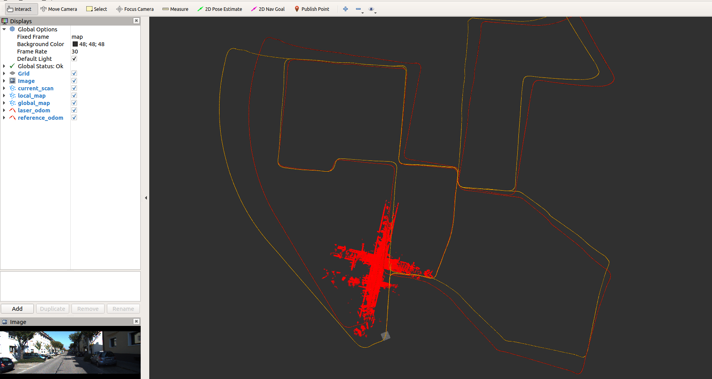
*  调用地图保持与地图显示 rosservice call /save_map   
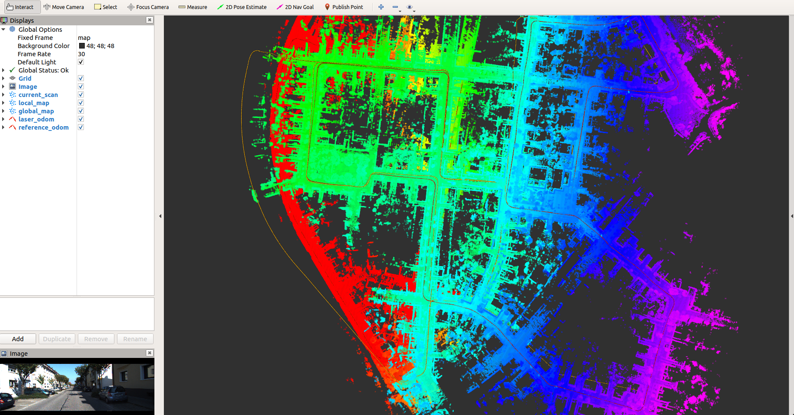
---
## 使用evo
命令如下：<br>
evo_rpe kitti ground_truth.txt laser_odom.txt -r trans_part --delta 100 --plot --plot_mode xyz<br>
evo_ape kitti ground_truth.txt laser_odom.txt -r full --plot --plot_mode xyz<br>
指标:   
max：表示最大误差；   
mean：平均误差；   
median：误差中位数；   
min：最小误差；   
rmse：均方根误差；   
sse：和方差、误差平方和；   
std：标准差   
NDT evo_rpe图表:<br>
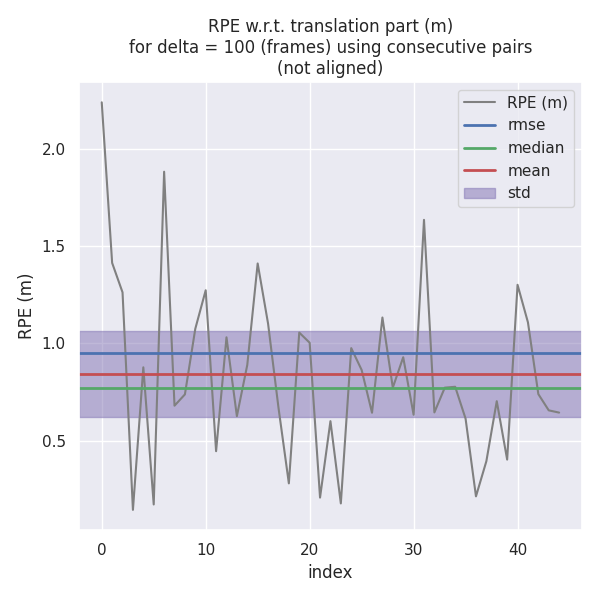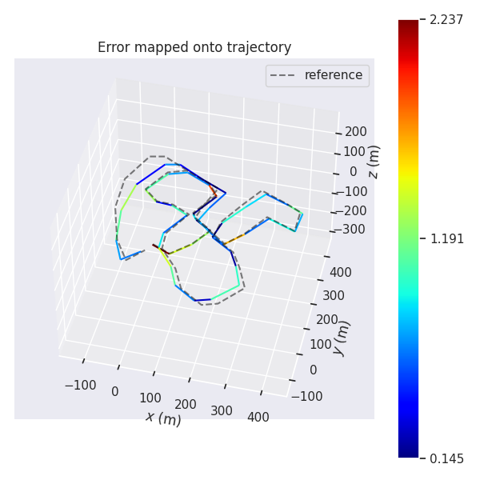<br>
NDT evo_ape图表:<br>
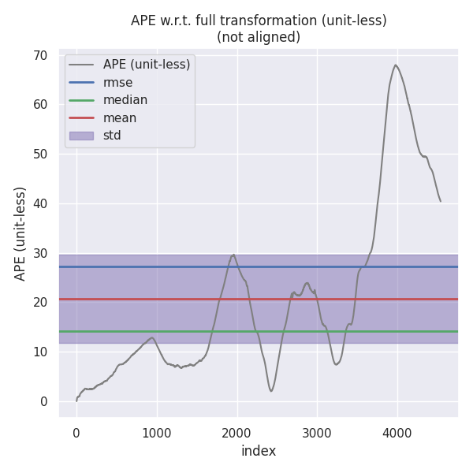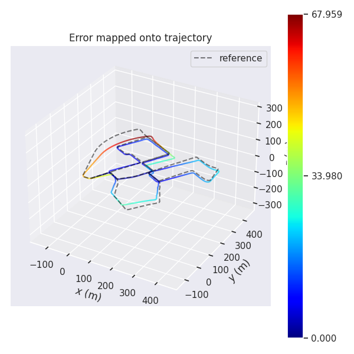<br>
ICP evo_rpe图表:<br>
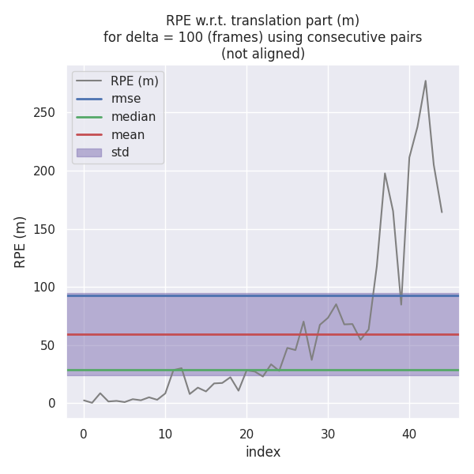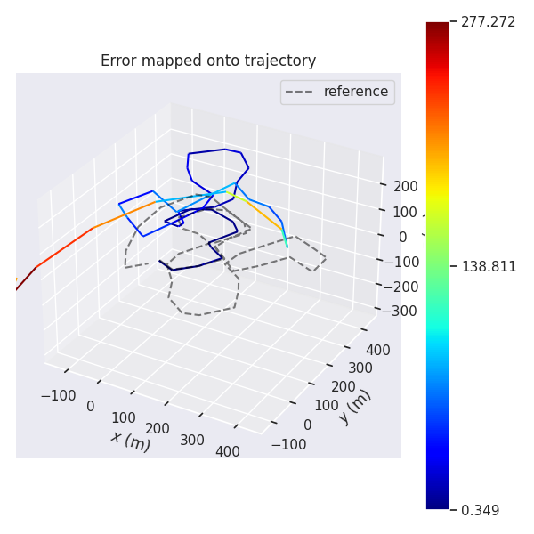<br>
ICP evo_ape图表:<br>
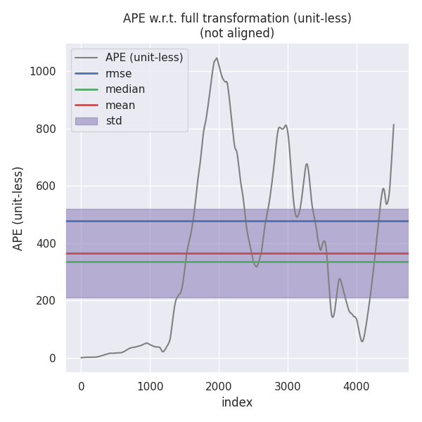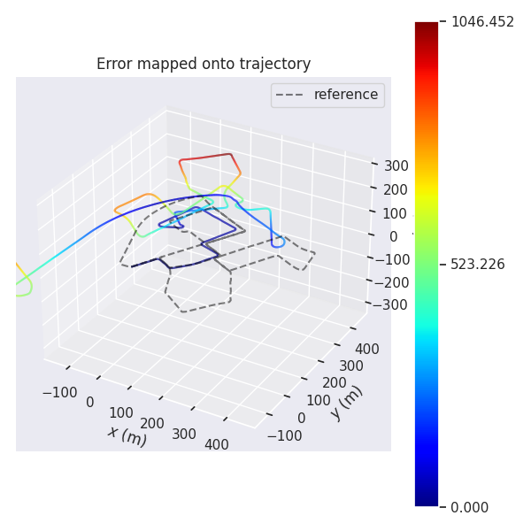<br>

 
| 方法     | max         | mean       | median     | min      | rmse       | sse               | std        |
| -------- | ----------- | ---------- | ---------- | -------- | ---------- | ----------------- | ---------- |
| evo_rpe: |
| NDT      | 2.237346    | 0.840434   | 0.772737   | 0.145416 | 0.949441   | 40.564705         | 0.441712   |
| ICP      | 277.272412  | 59.495329  | 28.539019  | 0.348698 | 92.620375  | 386034.025493     | 70.984785  |
| evo_ape: |
| NDT      | 67.959073   | 20.691909  | 14.167748  | 0.000002 | 27.246126  | 3371760.051167    | 17.725583  |
| ICP      | 1046.451926 | 365.245545 | 334.865135 | 0.000001 | 478.340314 | 1039481358.630141 | 308.877238 |
---
### 代码实现
SICP代码实现[here](lidar_localization/src/models/registration/sicp/sicp_registration.cpp#L60),按照SICP_TEST组装数据，调用写好的SICP<br>
ICP_SVD实现:<br>
ScanMatch[here](lidar_localization/src/models/registration/icp_svd_registration.cpp#L85),初始使用匀速预测predict_pose，再迭代transformation_,根据老师公式计算迭代R，左乘累加到transformation_中。循环完后，做下归一化<br>
```
int curr_iter = 0;
  while (curr_iter < max_iter_) {
    // TODO: apply current estimation:
    CloudData::CLOUD_PTR current_input(new CloudData::CLOUD());
    pcl::transformPointCloud(*transformed_input_source, *current_input,
                             transformation_);
    // TODO: get correspondence:
    std::vector<Eigen::Vector3f> xs;
    std::vector<Eigen::Vector3f> ys;

    int num_corr = GetCorrespondence(current_input, xs, ys);

    // TODO: do not have enough correspondence -- break:
    if (num_corr < 10)
      break;

    // TODO: update current transform:
    Eigen::Matrix4f transformation_delta;
    GetTransform(xs, ys, transformation_delta);

    // TODO: whether the transformation update is significant:
    if (!IsSignificant(transformation_delta, trans_eps_))
      break;

    // TODO: update transformation:
    transformation_ = transformation_delta * transformation_;

    ++curr_iter;
  }

  // set output:
  result_pose = transformation_ * predict_pose;

  Eigen::Matrix3f R = result_pose.block(0, 0, 3, 3);
  Eigen::Vector3f t = result_pose.block(0, 3, 3, 1);
  Eigen::Quaternionf q(R);
  q.normalize();
  result_pose.setIdentity();
  result_pose.block(0, 0, 3, 3) = q.toRotationMatrix();
  result_pose.block(0, 3, 3, 1) = t;

  pcl::transformPointCloud(*input_source_, *result_cloud_ptr, result_pose);
```
GetCorrespondence[here](lidar_localization/src/models/registration/icp_svd_registration.cpp#L134)，获取最近的一组X,Y<br>
```
const float MAX_CORR_DIST_SQR = max_corr_dist_ * max_corr_dist_;

  size_t num_corr = 0;

  // TODO: set up point correspondence
  for (size_t i = 0; i < input_source->points.size(); i++) {
    std::vector<int> pointIdx; //保存每个近邻点的索引
    std::vector<float>
        squaredDistance; //保存每个近邻点与查找 点之间的欧式距离平⽅
    if (input_target_kdtree_->nearestKSearch(input_source->points[i], 1,
                                             pointIdx, squaredDistance) > 0) {
      if (squaredDistance[0] > MAX_CORR_DIST_SQR)
        continue;
      Eigen::Vector3f x(input_target_->points[pointIdx[0]].x,
                        input_target_->points[pointIdx[0]].y,
                        input_target_->points[pointIdx[0]].z);

      Eigen::Vector3f y(input_source->points[i].x, input_source->points[i].y,
                        input_source->points[i].z);

      xs.push_back(x);
      ys.push_back(y);
      num_corr++;
    }
  }
```
GetTransform[here](lidar_localization/src/models/registration/icp_svd_registration.cpp#L166),也就是老师讲的流程严格实现<br>
```
const size_t N = xs.size();

  // TODO: find centroids of mu_x and mu_y:
  Eigen::Vector3f mu_x(0, 0, 0), mu_y(0, 0, 0);
  for (size_t i = 0; i < N; i++) {
    mu_x += xs[i];
    mu_y += ys[i];
  }
  //   std::cout << "-----------" << std::endl;
  //   std::cout << mu_x << std::endl;
  mu_x = mu_x / N;
  mu_y = mu_y / N;
  //   std::cout << mu_x << std::endl;

  std::vector<Eigen::Vector3f> xss;
  std::vector<Eigen::Vector3f> yss;
  for (size_t i = 0; i < N; i++) {
    xss.push_back(xs[i] - mu_x);
    yss.push_back(ys[i] - mu_y);
  }

  // TODO: build H:
  Eigen::Matrix3f H = Eigen::Matrix3f::Zero();
  for (size_t i = 0; i < N; i++) {
    H += yss[i] * xss[i].transpose();
  }

  Eigen::JacobiSVD<Eigen::Matrix3f> svd(H, Eigen::ComputeFullU |
                                               Eigen::ComputeFullV);
  Eigen::Matrix3f U = svd.matrixU();
  Eigen::Matrix3f V = svd.matrixV();

  // TODO: solve R:
  Eigen::Matrix3f R = V * U.transpose();

  // TODO: solve t:
  Eigen::Vector3f t;
  t = mu_x - R * mu_y;
  // TODO: set output:
  transformation_.setZero();
  transformation_.block(0, 0, 3, 3) = R;
  transformation_.block(0, 3, 3, 1) = t;
  transformation_(3, 3) = 1;
```

evo测试:   
SICP evo_rpe图表:<br>
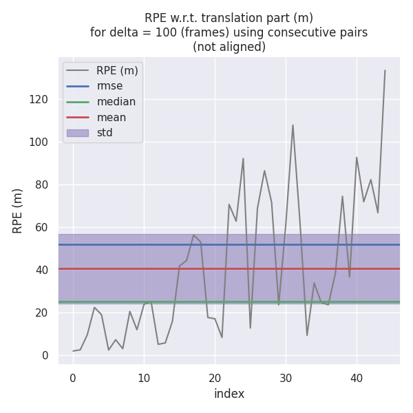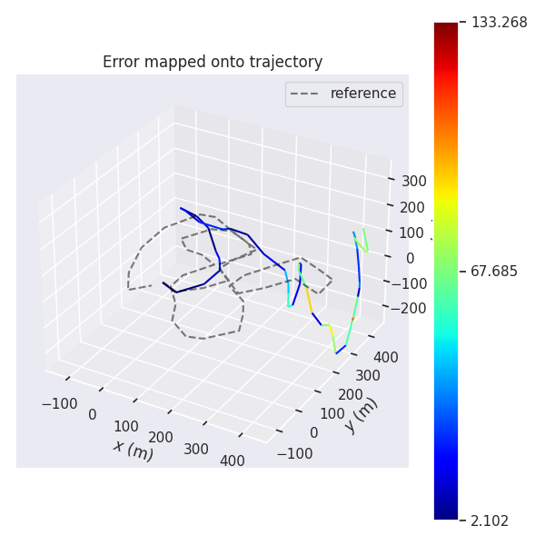<br>
SICP evo_ape图表:<br>
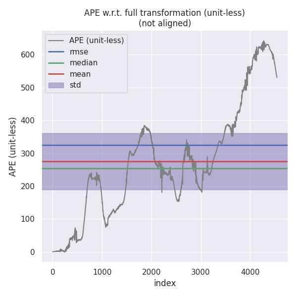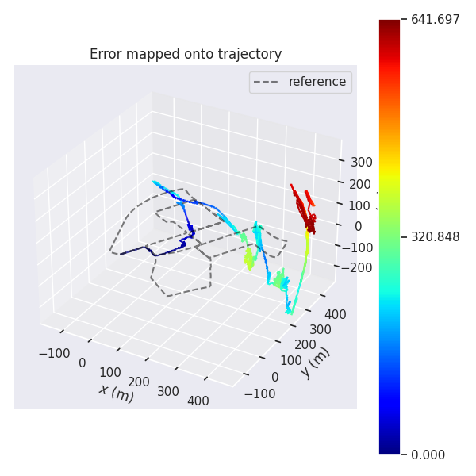<br>

ICP_SVD evo_rpe图表:<br>
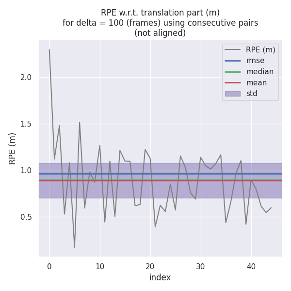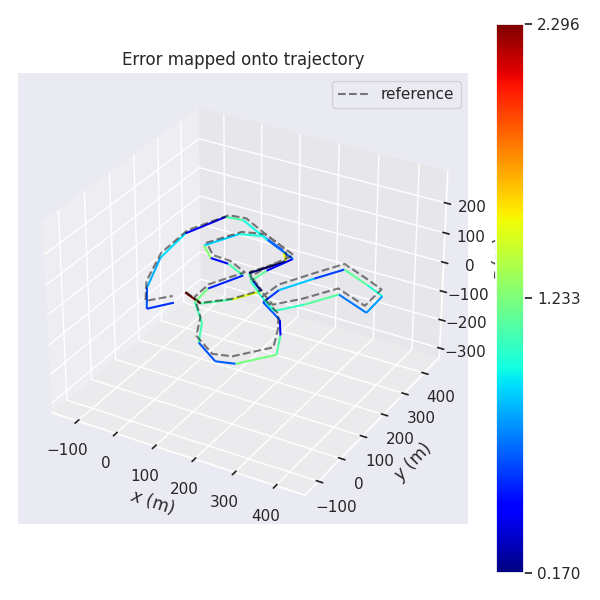<br>
ICP_SVD evo_ape图表:<br>
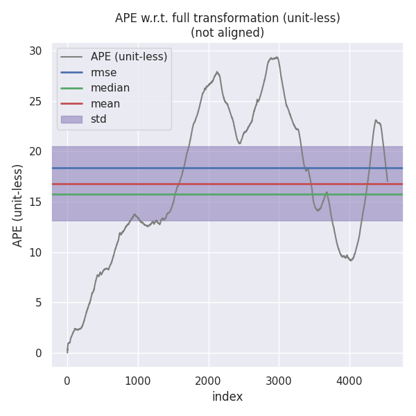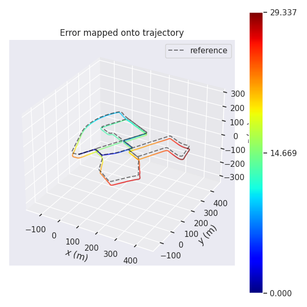<br>
汇总evo测试结果：   

| 方法     | max         | mean       | median     | min      | rmse       | sse               | std        |
| -------- | ----------- | ---------- | ---------- | -------- | ---------- | ----------------- | ---------- |
| evo_rpe: |
| NDT      | 2.237346    | 0.840434   | 0.772737   | 0.145416 | 0.949441   | 40.564705         | 0.441712   |
| ICP      | 277.272412  | 59.495329  | 28.539019  | 0.348698 | 92.620375  | 386034.025493     | 70.984785  |
| ICP_SVD  | 2.295545    | 0.888383   | 0.895189   | 0.169607 | 0.963945   | 41.813549         | 0.374119   |
| SICP     | 133.268038  | 40.546010  | 25.143353  | 2.101532 | 52.001375  | 121686.433481     | 32.560160  |
| evo_ape: |
| NDT      | 67.959073   | 20.691909  | 14.167748  | 0.000002 | 27.246126  | 3371760.051167    | 17.725583  |
| ICP      | 1046.451926 | 365.245545 | 334.865135 | 0.000001 | 478.340314 | 1039481358.630141 | 308.877238 |
| ICP_SVD  | 29.337443   | 16.785500  | 15.745290  | 0.000001 | 18.330628  | 1526502.088425    | 7.366065   |
| SICP     | 641.696804  | 275.404611 | 254.550631 | 0.000001 | 324.705382 | 478984776.546303  | 172.005480 |

总结：   
在分段统计中NDT与ICP_SVD差不多,但它俩明显优于SICP与ICP。在整体轨迹误差中,ICP_SVD稍微优于NDT,同样它俩明显优于SICP与ICP。虽然测试中SICP优于ICP,但SICP分析速度太慢。再目前数据情况下,建议NDT或ICP_SVD
