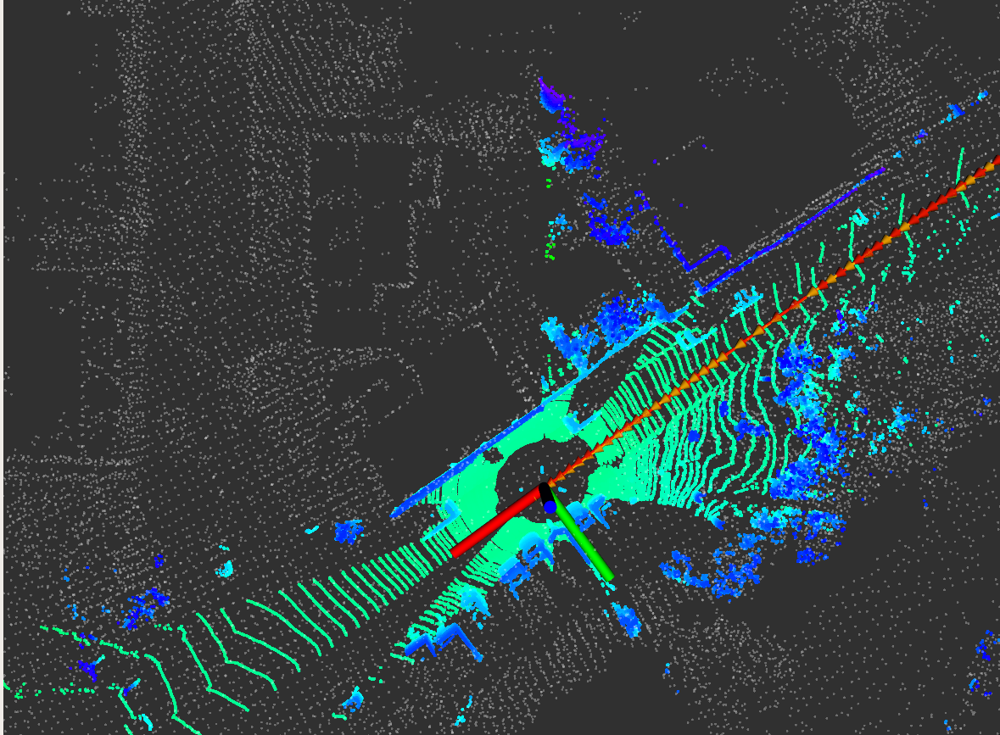

### 保存地图
按照作业提供的README内容修改项目,以下是复制README内容
打开lidar_localization/config/scan_context文件夹，输入如下命令，生成pb文件
```bash
protoc --cpp_out=./ key_frames.proto
protoc --cpp_out=./ ring_keys.proto
protoc --cpp_out=./ scan_contexts.proto
mv key_frames.pb.cc key_frames.pb.cpp
mv ring_keys.pb.cc ring_keys.pb.cpp
mv scan_contexts.pb.cc scan_contexts.pb.cpp
```
分别修改生成的三个.pb.cpp文件。如下，以ring_keys.pb.cpp为例。
```C++
// Generated by the protocol buffer compiler.  DO NOT EDIT!
// source: ring_keys.proto

#define INTERNAL_SUPPRESS_PROTOBUF_FIELD_DEPRECATION
#include "ring_keys.pb.h" 替换为  #include "lidar_localization/models/scan_context_manager/ring_keys.pb.h"

#include <algorithm>
```

之后，用以上步骤生成的的.pb.h文件替换lidar_localization/include/lidar_localization/models/scan_context_manager
中的同名文件。将.pb.cpp文件替换lidar_localization/src/models/scan_context_manager中的同名文件。   
编译项目，启动launch和bag，执行service保存地图   
```bash
# force backend optimization:
rosservice call /optimize_map
# save optimized map:
rosservice call /save_map 
# if you still use refence Scan Context Loop Closure implementation, execute this command.
rosservice call /save_scan_context 
```
效果如下:   

### 定位
使用框架默认定位一直在飘，就不截图了。直接上修改内容:   
launch中添加是否原点播放bag和定位方式采用gnss或scanContext
```bash
<param name="is_deviate_origin" value="true" />
<param name="initPose" value="1" /><!--1 gnss 2 sacncontext-->
```
代码中获取参数
```C++
nh.getParam("is_deviate_origin", is_deviate_origin);
```
参数设置完成后，定位方式根据配置文件处理
```C++
if (2 == initPose)
      matching_ptr_->SetScanContextPose(current_cloud_data_);
    else
      matching_ptr_->SetGNSSPose(current_gnss_data_.pose);
```
定义service保存地图建立时的原点
```C++
ros::ServiceServer service =
    nh.advertiseService("save_origin", save_origin_callback);

bool save_origin_callback(optimizeMap::Request &request,
                        optimizeMap::Response &response) {
_need_save_origin = true;
response.succeed = true;
return response.succeed;
}

if (_need_save_origin) {
    data_pretreat_flow_ptr->saveOrigin();
    _need_save_origin = false;
}

```
添加save_origin的service,对应保存方法
```C++
bool DataPretreatFlow::saveOrigin() {

  bool flag = InitGNSS();
  if (flag) {

    if (!FileManager::CreateFile(origin_ofs_, origin_path_ + "/origin.txt"))
      std::cout << "创建保存原始经纬度失败" << std::endl;

    double lon, lat, alt;
    GNSSData::getLonLat(lon, lat, alt);
    origin_ofs_ << std::setprecision(6) << std::fixed << lon;
    origin_ofs_ << ",";
    origin_ofs_ << std::setprecision(6) << std::fixed << lat;
    origin_ofs_ << ",";
    origin_ofs_ << std::setprecision(6) << std::fixed << alt;
    origin_ofs_.close();
  }
  return flag;
}
```
这样将原点数据保存在origin.txt中。数据预处理根据是否偏离原点进行不同的数据加载
```C++
bool DataPretreatFlow::InitGNSS() {
  static bool gnss_inited = false;
  if (!gnss_inited) {
    if (is_deviate_origin) {
      if (!FileManager::ReadFile(origin_ifs_, origin_path_ + "/origin.txt"))
        std::cout << "打开文件失败!" << std::endl;
      std::string str = "";
      getline(origin_ifs_, str);
      std::string split = ",";
      std::vector<std::string> strs = FileManager::split(str, split);

      if (0 == strs.size())
        return false;

      std::cout << "----------------" << std::endl;
      for (std::string s : strs)
        std::cout << s << std::endl;

      GNSSData gnss_data;
      gnss_data.longitude = std::atof(strs[0].c_str());
      gnss_data.latitude = std::atof(strs[1].c_str());
      gnss_data.altitude = std::atof(strs[2].c_str());

      gnss_data.InitOriginPosition();
      gnss_inited = true;

    } else {
      GNSSData gnss_data = gnss_data_buff_.front();
      gnss_data.InitOriginPosition();
      gnss_inited = true;
    }
  }

  return gnss_inited;
}
```
执行service 
```bash
rosservice call /save_origin
```
保存数据如下:
```txt
8.390450,48.982651,116.395850
```
下来进行测试  
1.不偏离原点，GNSS定位   
```bash
<param name="is_deviate_origin" value="false" />
<param name="initPose" value="1" /><!--1 gnss 2 sacncontext-->
```
效果如下：   

2.不偏离原点，sacncontext定位   
```bash
<param name="is_deviate_origin" value="false" />
<param name="initPose" value="2" /><!--1 gnss 2 sacncontext-->
```
效果如下：   

3.偏离原点，GNSS定位   
```bash
<param name="is_deviate_origin" value="true" />
<param name="initPose" value="1" /><!--1 gnss 2 sacncontext-->
```
效果如下： 

bag时间100s   

bag时间200s   

bag时间300s   

bag时间400s   

4.偏离原点，scancontext定位   
```bash
<param name="is_deviate_origin" value="true" />
<param name="initPose" value="2" /><!--1 gnss 2 sacncontext-->
```
效果如下： 

bag时间100s   

bag时间200s   

bag时间300s   

bag时间400s   

