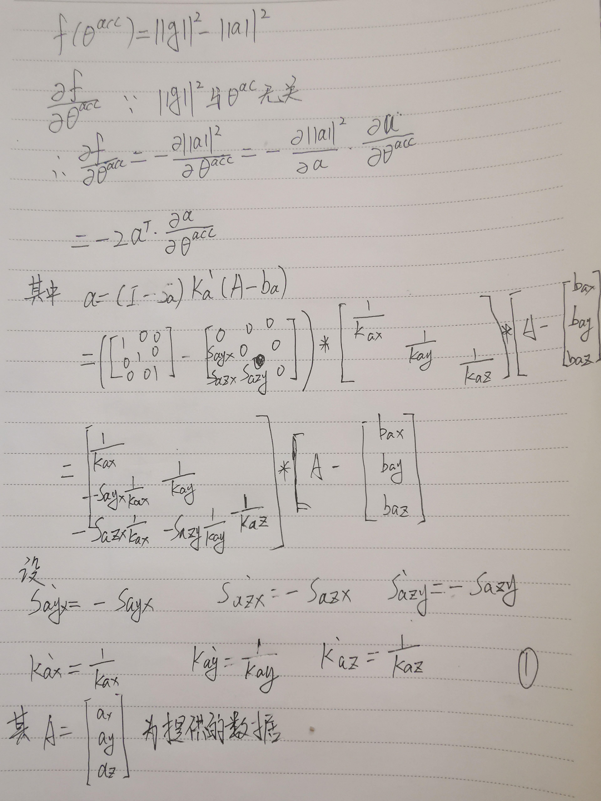
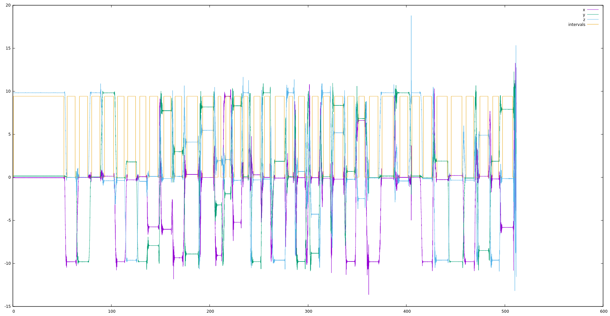
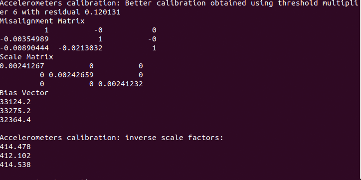
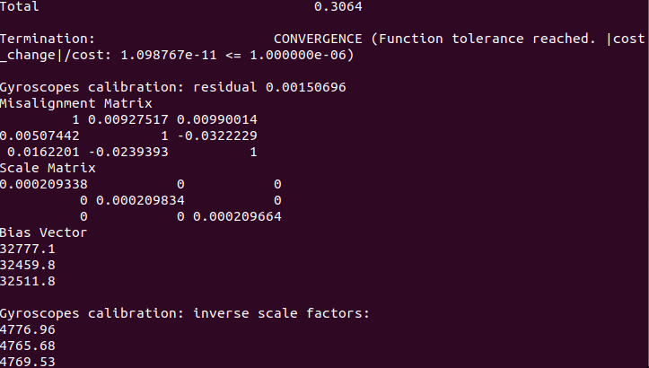

### 雅克比矩阵推导


下面用sympy推导的[here](imu_tk/scripts/acc_jacobian.py)   
a矩阵
$$
\left[\begin{matrix}Kax \left(Ax - bax\right)\\Kax Sayx \left(Ax - bax\right) + Kay \left(Ay - bay\right)\\Kax Sazx \left(Ax - bax\right) + Kay Sazy \left(Ay - bay\right) + Kaz \left(Az - baz\right)\end{matrix}\right]
$$
对Sayx求偏导
$$
\left[\begin{matrix}0\\Kax \left(Ax - bax\right)\\0\end{matrix}\right]
$$
对Sazx求偏导
$$
\left[\begin{matrix}0\\0\\Kax \left(Ax - bax\right)\end{matrix}\right]
$$
对Sazy求偏导
$$
\left[\begin{matrix}0\\0\\Kay \left(Ay - bay\right)\end{matrix}\right]
$$
对Kax求偏导
$$
\left[\begin{matrix}Ax - bax\\Sayx \left(Ax - bax\right)\\Sazx \left(Ax - bax\right)\end{matrix}\right]
$$
对Kay求偏导
$$
\left[\begin{matrix}0\\Ay - bay\\Sazy \left(Ay - bay\right)\end{matrix}\right]
$$
对Kaz求偏导
$$
\left[\begin{matrix}0\\0\\Az - baz\end{matrix}\right]
$$
对bax求偏导
$$
\left[\begin{matrix}- Kax\\- Kax Sayx\\- Kax Sazx\end{matrix}\right]
$$
对bay求偏导
$$
\left[\begin{matrix}0\\- Kay\\- Kay Sazy\end{matrix}\right]
$$
对baz求偏导
$$
\left[\begin{matrix}0\\0\\- Kaz\end{matrix}\right]
$$
$$
J_f = -2a^T\cdot
\left[\begin{matrix}\frac{\partial a}{\partial Sayx}~~
\frac{\partial a}{\partial Sazx}~~
\frac{\partial a}{\partial Sazy}~~
\frac{\partial a}{\partial Kax}~~ 
\frac{\partial a}{\partial Kay}~~ 
\frac{\partial a}{\partial Kaz}~~ 
\frac{\partial a}{\partial bax}~~ 
\frac{\partial a}{\partial bay}~~ 
\frac{\partial a}{\partial baz}
\end{matrix}\right]
$$
### 代码实现
ppt中提供的公式与imu_tk论文中提供的公式不同，下面按照代码中TODO进行处理。  
在calibration.h 中是这样定义的
```C++
mis_mat_ <<  _T(1)   , -mis_yz  ,  mis_zy  ,
                mis_xz ,  _T(1)   , -mis_zx  ,  
               -mis_xy ,  mis_yx  ,  _T(1)   ;
              
  scale_mat_ <<   s_x  ,   _T(0)  ,  _T(0) ,
                 _T(0) ,    s_y   ,  _T(0) ,  
                 _T(0) ,   _T(0)  ,   s_z  ;
                    
  bias_vec_ <<  b_x , b_y , b_z ; 
```
下面对代码进行修改:   
[here](imu_tk/src/calibration.cpp#L212)
```C++
// acc_calib_params[0] = init_acc_calib_.misYZ();
// acc_calib_params[1] = init_acc_calib_.misZY();
// acc_calib_params[2] = init_acc_calib_.misZX();

acc_calib_params[0] = init_acc_calib_.misXZ();
acc_calib_params[1] = init_acc_calib_.misXY();
acc_calib_params[2] = init_acc_calib_.misYX();
```
[here](imu_tk/src/calibration.cpp#L280)
```C++
0, 0, 0,
min_cost_calib_params[0],
min_cost_calib_params[1],
min_cost_calib_params[2],
```
[here](imu_tk/src/calibration.cpp#L85)
```C++
// mis_yz, mis_zy, mis_zx:
_T2(0), _T2(0), _T2(0),
// mis_xz, mis_xy, mis_yx:
params[0], params[1], params[2],
```
效果如下:    
<br>
加速度结果   
<br>
磁力计结果   
<br>