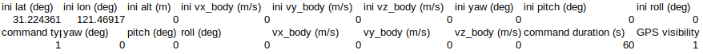

### 完善步骤
根据TODO完成代码如下
```C++
// TODO: implement your estimation here
//
while (imu_data_buff_.size() > 1) {
    // std::cout << "---------------------" << std::endl;
    // get deltas:
    Eigen::Vector3d angular_delta;
    GetAngularDelta(1, 0, angular_delta);
    // update orientation:
    Eigen::Matrix3d R_curr;
    Eigen::Matrix3d R_prev;

    UpdateOrientation(angular_delta, R_curr, R_prev);

    // get velocity delta:
    double delta_t;
    Eigen::Vector3d velocity_delta;
    GetVelocityDelta(1, 0, R_curr, R_prev, delta_t, velocity_delta);

    // update position:
    UpdatePosition(delta_t, velocity_delta);
    // move forward --
    // NOTE: this is NOT fixed. you should update your buffer according to the method of your choice:
    imu_data_buff_.pop_front();
}
```
### 中值法与欧拉法
代码中完成了终值法，增加判断系数，完成欧拉法
```C++
if (1 == approximate_method)
    angular_delta = 0.5 * delta_t * (angular_vel_curr + angular_vel_prev);
else
    angular_delta = angular_vel_prev * delta_t;
```
效果如下：   
中值法   
<br>
欧拉法   
<br>
可以看到欧拉法第一圈后半段时候，已经发生了很大的漂移。中值法第一圈与实际轨迹完全相符

### GNSS-Ins-Sim 静止 匀速 加减速 快速转弯
---
bias这里一直有疑问，助教老师一直帮忙解答，特此感谢！！！

总结如下

allan曲线只是用来衡量imu的性能。kalman是基于模型的估计，所以要对imu建模，通常把imu建模成收到bias和noise的影响，是来源于NASA的论文。建模时就用了两项噪声，nbw的噪声是rate random walk。nw是random walk. 标定中的bias也是零偏，把零偏当成常数来估。

---
GNSS-Ins-Sim参数参考这里 [here](https://github.com/kuafuliu/gnss-ins-sim/blob/master/gnss_ins_sim/docs/gnss-ins-sim-doc.md) 
以下对参数一些解释 
```Python
# gyro angle random walk, deg/rt-hr 随机游走
'gyro_arw': np.array([0., 0., 0.]),
# gyro bias instability, deg/hr 零偏
'gyro_b_stability': np.array([0., 0., 0.]), 
# gyro bias isntability correlation time, sec 零偏模型 设置为inf 随机游走模型，设置为正实数，一阶马尔科夫模型
'gyro_b_corr': np.array([100.0, 100.0, 100.0]),
# b. deterministic error: 标定参数
'gyro_b': np.array([0.0, 0.0, 0.0]),
'gyro_k': np.array([1.0, 1.0, 1.0]),
'gyro_s': np.array([0.0, 0.0, 0.0, 0.0, 0.0, 0.0]),
```
GNSS-Ins-Sim 模型指定参考这里[here](https://www.i4k.xyz/article/weixin_44156680/117332819)

通过写入到csv中，进行运动定义，主要使用到两种指令格式， command type 1 和 command type 2

1 定义在command duration 时间内的速率和角速率变化，可用于加速，匀速运动

2 定义在command duration 时间内达到预设的角度(绝对) 和 速度

定义零误差模型，仿照recorder_node_allan_variance_analysis.py写的，列出关键部分
```Python
def get_gnss_ins_sim(motion_def_file, fs_imu, fs_gps):
    ...
    #默认不是从0开始，从bag里查出来，补偿掉
    origin_x = 2849886.618251
    origin_y = -4656214.272942
    origin_z = -3287190.600463

    # set IMU model:
    D2R = math.pi/180.0
    # imu_err = 'low-accuracy'
    imu_err = {
        # 1. gyro:
        # a. random noise:
        # gyro angle random walk, deg/rt-hr
        'gyro_arw': np.array([0., 0., 0.]),
        # gyro bias instability, deg/hr
        'gyro_b_stability': np.array([0., 0., 0.]),
        # gyro bias isntability correlation time, sec
        'gyro_b_corr': np.array([100.0, 100.0, 100.0]),
        # b. deterministic error:
        'gyro_b': np.array([0.0, 0.0, 0.0]),
        'gyro_k': np.array([1.0, 1.0, 1.0]),
        'gyro_s': np.array([0.0, 0.0, 0.0, 0.0, 0.0, 0.0]),
        # 2. accel:
        # a. random noise:
        # accel velocity random walk, m/s/rt-hr
        'accel_vrw': np.array([0., 0., 0.]),
        # accel bias instability, m/s2
        'accel_b_stability': np.array([0., 0., 0.]),
        # accel bias isntability correlation time, sec
        'accel_b_corr': np.array([100.0, 100.0, 100.0]),
        # b. deterministic error:
        'accel_b': np.array([0., 0., 0.]),
        'accel_k': np.array([1.0, 1.0, 1.0]),
        'accel_s': np.array([0.0, 0.0, 0.0, 0.0, 0.0, 0.0]),
        # 3. mag:
        'mag_si': np.eye(3) + np.random.randn(3, 3)*0.0, 
        'mag_hi': np.array([10.0, 10.0, 10.0])*0.0,
        'mag_std': np.array([0.1, 0.1, 0.1])
    }
    # generate GPS and magnetometer data:
    ...

    # imu measurements:
    step_size = 1.0 / fs_imu
    for i, (gyro, accel, ref_q, ref_pos, ref_vel) in enumerate(
        zip(
            #修改为无噪声模型 gyro 修改 ref_gyro 、 accel 修改为 ref_accel
            # a. gyro
            # sim.dmgr.get_data_all('gyro').data[0], 
            sim.dmgr.get_data_all('ref_gyro').data,
            # b. accel
            # sim.dmgr.get_data_all('accel').data[0],
            sim.dmgr.get_data_all('ref_accel').data,
            # c. gt_pose:
            sim.dmgr.get_data_all('ref_att_quat').data,                # groundtruth
            sim.dmgr.get_data_all('ref_pos').data,
            # d. true_vel :
            sim.dmgr.get_data_all('ref_vel').data
        )
    ):
        yield {
            'stamp': i * step_size,
            'data': {
                # a. gyro:
                'gyro_x': gyro[0],
                'gyro_y': gyro[1],
                'gyro_z': gyro[2],
                # b. accel:
                'accel_x': accel[0],
                'accel_y': accel[1],
                'accel_z': accel[2],
                # c. true orientation:
                'gt_quat_w': ref_q[0],
                'gt_quat_x': ref_q[1],
                'gt_quat_y': ref_q[2],
                'gt_quat_z': ref_q[3],
                # d. true position:
                'gt_pos_x': ref_pos[0]+origin_x,
                'gt_pos_y': ref_pos[1]+origin_y,
                'gt_pos_z': ref_pos[2]+origin_z,
                # d. true velocity:
                'gt_vel_x': ref_vel[0],
                'gt_vel_y': ref_vel[1],
                'gt_vel_z': ref_vel[2]

            }
        }

    sim.results()
    sim.plot(['ref_pos', 'ref_vel'], opt={'ref_pos': '3d'})


def gnss_ins_sim_recorder():
    ...
    motion_def_name = rospy.get_param('/recorder_node_no_error/motion_file')
    sample_freq_imu = rospy.get_param('/recorder_node_no_error/sample_frequency/imu')
    sample_freq_gps = rospy.get_param('/recorder_node_no_error/sample_frequency/gps')
    topic_name_imu = rospy.get_param('/recorder_node_no_error/topic_name_imu')
    topic_name_gt = rospy.get_param('/recorder_node_no_error/topic_name_gt')

    rosbag_output_path = rospy.get_param('/recorder_node_no_error/output_path')
    rosbag_output_name = rospy.get_param('/recorder_node_no_error/output_name')

    ...

    with rosbag.Bag(
        os.path.join(rosbag_output_path, rosbag_output_name), 'w'
    ) as bag:
        # get timestamp base:
        timestamp_start = rospy.Time.now()

        for measurement in imu_simulator:
            # init:
            msg = Imu()
            # a. set header:
            msg.header.frame_id = 'inertial'
            msg.header.stamp = timestamp_start + rospy.Duration.from_sec(measurement['stamp'])
            # b. set orientation estimation:
            msg.orientation.x = 0.0
            msg.orientation.y = 0.0
            msg.orientation.z = 0.0
            msg.orientation.w = 1.0
            # c. gyro:
            msg.angular_velocity.x = measurement['data']['gyro_x']
            msg.angular_velocity.y = measurement['data']['gyro_y']
            msg.angular_velocity.z = measurement['data']['gyro_z']
            msg.linear_acceleration.x = measurement['data']['accel_x']
            msg.linear_acceleration.y = measurement['data']['accel_y']
            msg.linear_acceleration.z = measurement['data']['accel_z']

            # write:
            bag.write(topic_name_imu, msg, msg.header.stamp)

            # init :  groundtruth
            msg_odom = Odometry()
            # a.set header:
            msg_odom.header.frame_id = 'inertial'
            msg_odom.header.stamp =    msg.header.stamp
            # b.set gt_pose
            msg_odom.pose.pose.position.x =  measurement['data']['gt_pos_x']   
            msg_odom.pose.pose.position.y =  measurement['data']['gt_pos_y']  
            msg_odom.pose.pose.position.z =  measurement['data']['gt_pos_z']   

            msg_odom.pose.pose.orientation.w = measurement['data']['gt_quat_w']
            msg_odom.pose.pose.orientation.x = measurement['data']['gt_quat_x']
            msg_odom.pose.pose.orientation.y = measurement['data']['gt_quat_y']
            msg_odom.pose.pose.orientation.z = measurement['data']['gt_quat_z']
            #c.set gt_vel
            msg_odom.twist.twist.linear.x = measurement['data']['gt_vel_x']
            msg_odom.twist.twist.linear.y = measurement['data']['gt_vel_y']
            msg_odom.twist.twist.linear.z = measurement['data']['gt_vel_z']

            # write 
            bag.write(topic_name_gt, msg_odom, msg_odom.header.stamp)
```
```Yaml
# motion def:
motion_file: static.csv
# IMU params:
imu: 1
# sample frequency of simulated GNSS/IMU data:
sample_frequency:
    imu: 100.0
    gps: 10.0
# topic name:
topic_name_imu: /sim/sensor/imu
topic_name_gt:  /pose/ground_truth
# output rosbag path:
output_path: /home/eric/fusion_work/src/gnss_ins_sim/bag
# output name:
output_name: static.bag
```
```Launch
<launch>
    <node name="recorder_node_no_error" pkg="gnss_ins_sim" type="recorder_node_no_error.py">
        <!-- load default params -->
        <rosparam command="load" file="$(find gnss_ins_sim)/config/recorder_no_error.yaml" />

        <!-- configuration -->
    </node>
</launch>
```
定义运动：

急速转弯

<br>
<br>
静止

<br>
<br>
恒定速度

<br>
<br>
加速

<br>
<br>
加减速

<br>
<br>

修改estimator.yaml
```Yaml
imu:
    topic_name: /sim/sensor/imu
    gravity:
        x:  0.0
        y:  0.0
        #gnss_ins_sim的z为 -9.794216,原代码z为-9.81
        z: -9.794216
    bias:
        angular_velocity:
            x: 0.0
            y: 0.0
            z: 0.0
        linear_acceleration:
            x: 0.0
            y: 0.0
            z: 0.0
            
pose:
    frame_id: inertial
    topic_name: 
        ground_truth: /pose/ground_truth
        estimation: /pose/estimation
approximate_method: 2 #1中值法 2 欧拉法
```
使用evo tum比对
参考这里[here](https://blog.csdn.net/u011341856/article/details/104594392)   
存储evo tum数据
```C++
#include <fstream>
#include <iomanip>
#include <iostream>
#include <list>
#include <sstream>
#include <string>
#include <vector>

#include <geometry_msgs/PoseStamped.h>
#include <nav_msgs/Odometry.h>
#include <ros/ros.h>
#include <Eigen/Core>
#include <Eigen/Dense>

struct pose {
    double timestamp;
    Eigen::Vector3d pos;
    Eigen::Quaterniond q;
};

pose pose_gt;
pose pose_esti;

std::ofstream gt;
std::ofstream esti;

double stamp_gt = 0;
double stamp_ins = 0;

double stamp_gt_init = 0;
double stamp_esti_init = 0;

int flag_gt = 1;
int flag_esti = 1;

bool createFile(std::ofstream& ofs, std::string path) {
    ofs.open(path, std::ios::out);
    if (!ofs) {
        std::cout << "open path error" << std::endl;
        return false;
    }

    return true;
}
/*write to txt, fomat TUM*/
void writeText(std::ofstream& ofs, pose data) {
    ofs << std::fixed << data.timestamp << " " << data.pos.x() << " " << data.pos.y() << " " << data.pos.z() << " "
        << data.q.x() << " " << data.q.y() << " " << data.q.z() << " " << data.q.w() << std::endl;
}

void estiCallBack(const nav_msgs::Odometry::ConstPtr& msg) {
    if (flag_esti) {
        stamp_esti_init = msg->header.stamp.toSec();
        flag_esti = 0;
    }

    pose_esti.timestamp = msg->header.stamp.toSec() - stamp_esti_init;

    pose_esti.pos.x() = msg->pose.pose.position.x;
    pose_esti.pos.y() = msg->pose.pose.position.y;
    pose_esti.pos.z() = msg->pose.pose.position.z;

    pose_esti.q.w() = msg->pose.pose.orientation.w;
    pose_esti.q.x() = msg->pose.pose.orientation.x;
    pose_esti.q.y() = msg->pose.pose.orientation.y;
    pose_esti.q.z() = msg->pose.pose.orientation.z;

    writeText(esti, pose_esti);
}

void gtCallBack(const nav_msgs::Odometry::ConstPtr& msg) {
    if (flag_gt) {
        stamp_gt_init = msg->header.stamp.toSec();
        flag_gt = 0;
    }

    pose_gt.timestamp = msg->header.stamp.toSec() - stamp_gt_init;

    pose_gt.pos.x() = msg->pose.pose.position.x;
    pose_gt.pos.y() = msg->pose.pose.position.y;
    pose_gt.pos.z() = msg->pose.pose.position.z;

    pose_gt.q.w() = msg->pose.pose.orientation.w;
    pose_gt.q.x() = msg->pose.pose.orientation.x;
    pose_gt.q.y() = msg->pose.pose.orientation.y;
    pose_gt.q.z() = msg->pose.pose.orientation.z;
    writeText(gt, pose_gt);
}

int main(int argc, char** argv) {
    char path_gt[] = "/home/eric/fusion_work/src/imu_integration/evo/gt.txt";
    char path_esti[] = "/home/eric/fusion_work/src/imu_integration/evo/esti.txt";

    std::cout << "启动evaluate_node..." << std::endl;
    createFile(gt, path_gt);
    createFile(esti, path_esti);

    ros::init(argc, argv, "evaluate_node");

    ros::NodeHandle nh;

    ros::Subscriber sub_gt = nh.subscribe("/pose/ground_truth", 1000, gtCallBack);
    ros::Subscriber sub_esti = nh.subscribe("/pose/estimation", 1000, estiCallBack);

    ros::Rate loop_rate(100);
    while (ros::ok()) {
        ros::spinOnce();
        loop_rate.sleep();
    }

    gt.close();
    esti.close();

    return 0;
}

```
```Launch
<launch>
    <node pkg="tf" type="static_transform_publisher" name="ENU_broadcaster" args="0 0 0 0 0 0 inertial ENU 200" />
    

    <node pkg="imu_integration" type="estimator_node" name="imu_integration_estimator_node" clear_params="true" output="screen">
        <!-- load default params -->
        <rosparam command="load" file="$(find imu_integration)/config/estimator.yaml" />

        <!-- custom configuration -->
    </node>

    <node pkg="imu_integration" type="evaluate_node" name="evaluate_node"  output="screen"/>

     <!-- <node name="rviz" pkg="rviz" type="rviz" args="-d $(find imu_integration)/rviz/imu_integration.rviz" required="true" />  -->
</launch>
```
```bash
evo_rpe tum gt.txt esti.txt -r full --delta 100 --plot --plot_mode xyz
```
为了节省篇幅，只记录rmse

| 方法     | 中值法   | 欧拉法   |
| -------- | -------- | -------- |
| 急速转弯 | 0.009394 | 0.036483 |
| 静止     | 0.000032 | 0.000032 |
| 恒定速度 | 0.000032 | 0.000032 |
| 加速     | 0.106917 | 0.521282 |
| 加减速   | 0.682966 | 0.584425 |

结论：静止、恒定速度中值法与欧拉法相同,急速转弯与加速中值法精度高于欧拉法，加减速中值法精度低于欧拉法，大部分场景中值法优于欧拉法。
