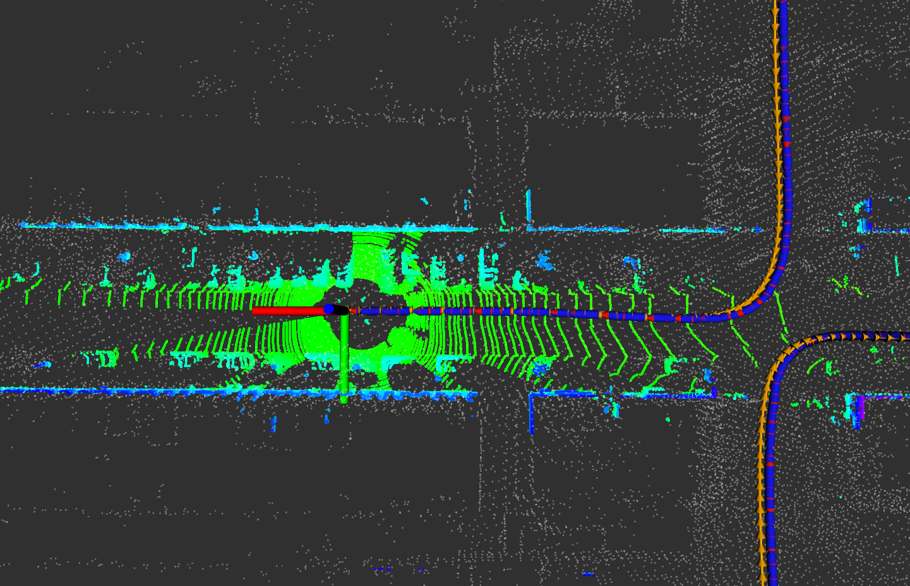
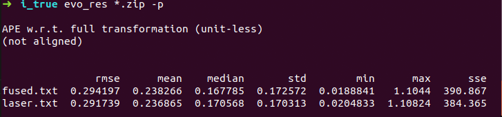
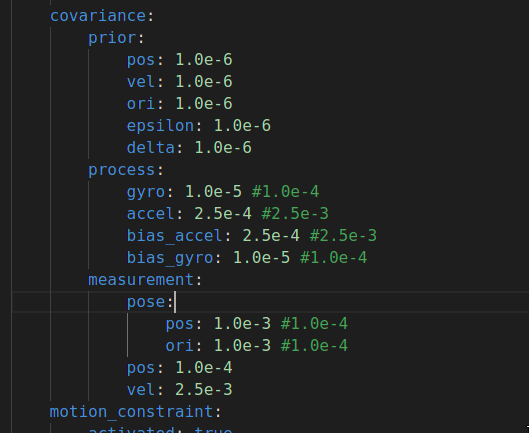
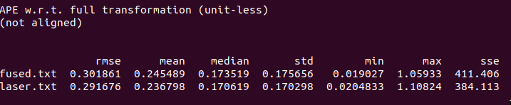
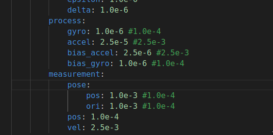
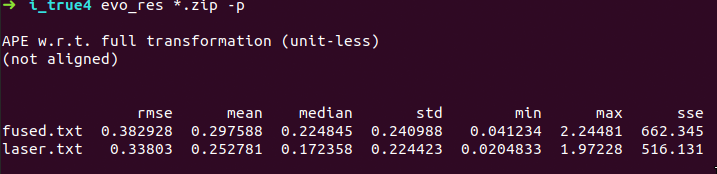
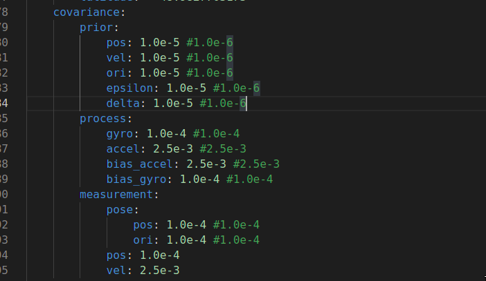
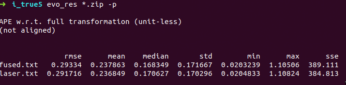
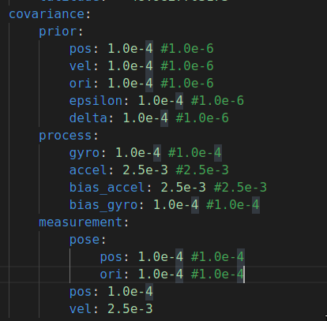
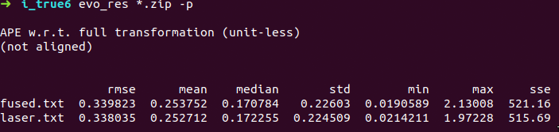

### 补充代码部分
SetProcessEquation
```C++
    // TODO: set process / system equation:
    // a. set process equation for delta vel:

    F_.block<3, 3>(kIndexErrorVel, kIndexErrorOri) = -C_nb * Sophus::SO3d::hat(f_n).matrix();
    F_.block<3, 3>(kIndexErrorVel, kIndexErrorAccel) = -C_nb;
    F_.block<3, 3>(kIndexErrorOri, kIndexErrorOri) = -Sophus::SO3d::hat(w_b).matrix();
    // b. set process equation for delta ori:
    B_.block<3, 3>(kIndexErrorVel, kIndexNoiseAccel) = C_nb;
```
UpdateOdomEstimation 基本和第六章的作业一样
```C++
    size_t index_curr = 1;
    size_t index_prev = 0;
    // get deltas:
    Eigen::Vector3d angular_delta = Eigen::Vector3d::Zero();
    GetAngularDelta(index_curr, index_prev, angular_delta, angular_vel_mid);
    // update orientation:
    Eigen::Matrix3d R_curr = Eigen::Matrix3d::Zero();
    Eigen::Matrix3d R_prev = Eigen::Matrix3d::Zero();
    UpdateOrientation(angular_delta, R_curr, R_prev);

    // get velocity delta:
    double T;
    Eigen::Vector3d velocity_delta = Eigen::Vector3d::Zero();
    GetVelocityDelta(index_curr, index_prev, R_curr, R_prev, T, velocity_delta, linear_acc_mid);

    // save mid-value unbiased linear acc for error-state update:

    // update position:
    UpdatePosition(T, velocity_delta);
```
UpdateErrorEstimation 对应ppt中状态方程离散化,注意其中$w_k$为零均值，故$w_k$为0
```C++
    // TODO: update process equation:
    UpdateProcessEquation(linear_acc_mid, angular_vel_mid);
    // TODO: get discretized process equations:
    F_1st = F_ * T;
    F_2nd = MatrixF::Identity() + F_1st;

    MatrixB B = MatrixB::Zero();
    B.block<3, 3>(kIndexErrorVel, kIndexNoiseAccel) = B_.block<3, 3>(kIndexErrorVel, kIndexNoiseAccel) * T;
    B.block<3, 3>(kIndexErrorOri, kIndexNoiseGyro) = B_.block<3, 3>(kIndexErrorOri, kIndexNoiseGyro) * T;
    B.block<3, 3>(kIndexErrorAccel, kIndexNoiseBiasAccel) = B_.block<3, 3>(kIndexErrorAccel, kIndexNoiseBiasAccel) * sqrt(T);
    B.block<3, 3>(kIndexErrorGyro, kIndexNoiseBiasGyro) = B_.block<3, 3>(kIndexErrorGyro, kIndexNoiseBiasGyro) * sqrt(T);
    // TODO: perform Kalman prediction
    X_ = F_2nd * X_;
    P_ = F_2nd * P_ * F_2nd.transpose() + B * Q_ * B.transpose();
```
CorrectErrorEstimationPose 对应观察方程计算。这里直接根据ppt中计算后，初始化Y,计算K
```C++
    Eigen::Vector3d delta_p = pose_.block<3, 1>(0, 3) - T_nb.block<3, 1>(0, 3);
    Eigen::Matrix3d delta_R = T_nb.block<3, 3>(0, 0).transpose() * pose_.block<3, 3>(0, 0);
    Eigen::Vector3d delta_ori = Sophus::SO3d::vee(delta_R - Eigen::Matrix3d::Identity());

    YPose_.block<3, 1>(0, 0) = delta_p;
    YPose_.block<3, 1>(3, 0) = delta_ori;

    Y = YPose_;
    // TODO: set measurement equation:
    G = GPose_;

    // TODO: set Kalman gain:
    K = P_ * G.transpose() * (G * P_ * G.transpose() + CPose_ * RPose_ * CPose_.transpose()).inverse();
```
然后计算P与X
```C++
    P_ = (MatrixP::Identity() - K * G) * P_;
    X_ = X_ + K * (Y - G * X_);
```
EliminateError 对应ppt中的更新后验位姿
```C++
    // a. position:
    // do it!
    pose_.block<3, 1>(0, 3) -= X_.block<3, 1>(kIndexErrorPos, 0);
    // b. velocity:
    // do it!
    vel_ -= X_.block<3, 1>(kIndexErrorVel, 0);
    // c. orientation:
    // do it!
    pose_.block<3, 3>(0, 0) = pose_.block<3, 3>(0, 0) * (Eigen::Matrix3d::Identity() - Sophus::SO3d::hat(X_.block<3, 1>(kIndexErrorOri, 0)));

    Eigen::Quaterniond q(pose_.block<3, 3>(0, 0));
    q.normalize();
    pose_.block<3, 3>(0, 0) = q.toRotationMatrix();

    // d. gyro bias:
    if (IsCovStable(kIndexErrorGyro)) {
        gyro_bias_ -= X_.block<3, 1>(kIndexErrorGyro, 0);
    }

    // e. accel bias:
    if (IsCovStable(kIndexErrorAccel)) {
        accl_bias_ -= X_.block<3, 1>(kIndexErrorAccel, 0);
    }
}
```
效果如下   

### 不考虑随机游走
定义bias_flag,然后在构造函数做如下修改:
```C++
    // c. process noise:
    Q_.block<3, 3>(kIndexNoiseAccel, kIndexNoiseAccel) = COV.PROCESS.ACCEL * Eigen::Matrix3d::Identity();
    Q_.block<3, 3>(kIndexNoiseGyro, kIndexNoiseGyro) = COV.PROCESS.GYRO * Eigen::Matrix3d::Identity();
    if (bias_flag) {
        Q_.block<3, 3>(kIndexNoiseBiasAccel, kIndexNoiseBiasAccel) = COV.PROCESS.BIAS_ACCEL * Eigen::Matrix3d::Identity();
        Q_.block<3, 3>(kIndexNoiseBiasGyro, kIndexNoiseBiasGyro) = COV.PROCESS.BIAS_GYRO * Eigen::Matrix3d::Identity();
    }
    // d. measurement noise:
    RPose_.block<3, 3>(0, 0) = COV.MEASUREMENT.POSE.POSI * Eigen::Matrix3d::Identity();
    RPose_.block<3, 3>(3, 3) = COV.MEASUREMENT.POSE.ORI * Eigen::Matrix3d::Identity();

    // e. process equation:
    F_.block<3, 3>(kIndexErrorPos, kIndexErrorVel) = Eigen::Matrix3d::Identity();
    F_.block<3, 3>(kIndexErrorOri, kIndexErrorGyro) = -Eigen::Matrix3d::Identity();

    B_.block<3, 3>(kIndexErrorOri, kIndexNoiseGyro) = Eigen::Matrix3d::Identity();
    if (bias_flag) {
        B_.block<3, 3>(kIndexErrorAccel, kIndexNoiseBiasAccel) = Eigen::Matrix3d::Identity();
        B_.block<3, 3>(kIndexErrorGyro, kIndexNoiseBiasGyro) = Eigen::Matrix3d::Identity();
    }
```
对比odometry数据
```bash
evo_rpe kitti ground_truth.txt fused.txt -r trans_part --delta 100 --plot --plot_mode xyz
```
对比rmse.考虑随机游走：2.687764，不考虑随机游走：2.396791。从结果来看不考虑随机游走误差小些，当然也跟kitti数据有关，任老师说过实际中可以都尝试下，那个优用那个
### 参数调整
```bash
#保存雷达数据
evo_ape kitti ground_truth.txt laser.txt -r full --plot --plot_mode xy  --save_results ./laser.zip
#保存fuse数据
evo_ape kitti ground_truth.txt fused.txt -r full --plot --plot_mode xy  --save_results ./fused.zip
#数据比对
evo_res *.zip -p
```
1)原始参数结果  
<br> 
2)可以看到lidar精度与fuse精度差不多，但总体精度较低。考虑增加imu置信度，即减小imu的误差   
修改参数如下   
<br> 
结果如下   
<br> 
3)误差反而增大，并且laser精度变差，理论上应该不变，可能是数据问题。尝试减小laser置信度，即增大lidar误差
修改参数如下   
<br> 
结果如下   
<br> 
4)lidar精度与初始精度相同，fuse精度优于上次修改，但低于初始参数精度。继续增大imu置信度，进行测试   
修改参数如下   
<br> 
结果如下   
<br> 
5)效果不是很理想。还原默认参数，减少P置信度，即增大误差，测试下
修改参数如下   
<br> 
结果如下   
<br> 
6)fuse精度比默认环境稍微好一丢丢，尝试再次降低状态量置信度
修改参数如下   
<br> 

结果如下   
<br> 
精度变差
多次调整，只有第5次稍微好一点。个人觉得调参需要多次修改参数，进行数据验证，最终确认合适的参数