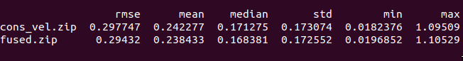
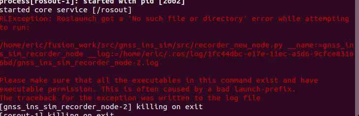
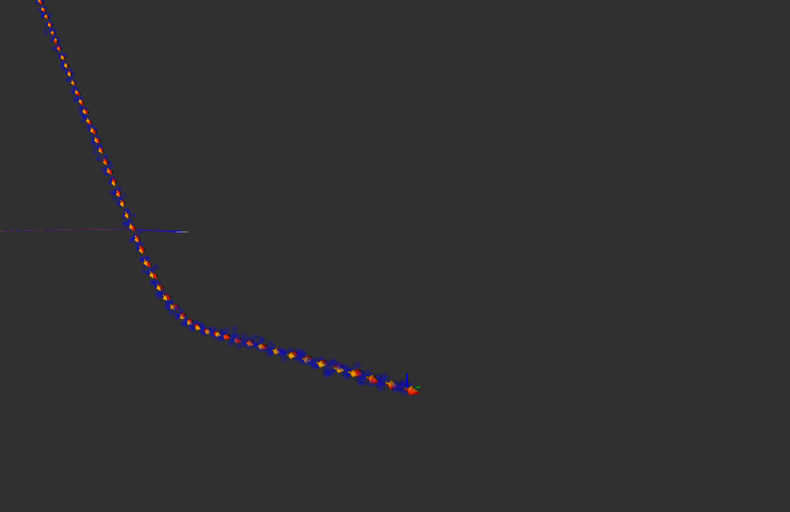
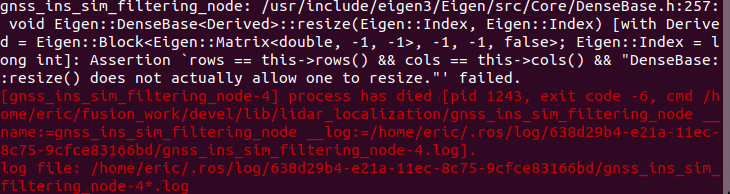
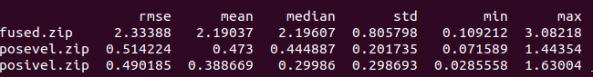

### 运动约束实现
其他部分数据与第七章类似，本章主要修改在CorrectErrorEstimation方法中.

运动约束代码中没有提供方法。故初始化变量YConsVel_，GConsVel_，CConsVel_，RConsVel_。

具体可见代码代码中，这里列出实现部分
```C++
void ErrorStateKalmanFilter::CorrectErrorEstimationConsVel(
    const Eigen::Matrix4d &T_nb, const Eigen::Vector3d &v_b, const Eigen::Vector3d &w_b,
    Eigen::VectorXd &Y, Eigen::MatrixXd &G, Eigen::MatrixXd &K) {
    //
    // TODO: set measurement:
    //
    Eigen::Vector3d delta_p = pose_.block<3, 1>(0, 3) - T_nb.block<3, 1>(0, 3);
    Eigen::Matrix3d delta_R = T_nb.block<3, 3>(0, 0).transpose() * pose_.block<3, 3>(0, 0);
    Eigen::Vector3d delta_ori = Sophus::SO3d::vee(delta_R - Eigen::Matrix3d::Identity());
    // set measurement equation:

    YConsVel_.block<3, 1>(0, 0) = delta_p;
    YConsVel_.block<3, 1>(5, 0) = delta_ori;
    Y = YConsVel_;

    GConsVel_.setZero();

    GConsVel_.block<3, 3>(0, 0) = Eigen::Matrix3d::Identity();
    GConsVel_.block<2, 3>(3, 3) = (pose_.block<3, 3>(0, 0).transpose()).block<2, 3>(1, 0);
    GConsVel_.block<2, 3>(3, 6) = (Sophus::SO3d::hat(pose_.block<3, 3>(0, 0).transpose() * v_b).matrix()).block<2, 3>(1, 0);
    GConsVel_.block<3, 3>(5, 6) = Eigen::Matrix3d::Identity();
    G = GConsVel_;

    Eigen::MatrixXd C = CConsVel_;
    Eigen::MatrixXd R = RConsVel_;
    //
    // TODO: set Kalman gain:
    //

    K = P_ * G.transpose() * (G * P_ * G.transpose() + C * R * C.transpose()).inverse();
}
```
完全按ppt中实现。建图就不贴了，与第七章一样。
```bash
#保存两个zip，一个原始融合，一个运动控制
evo_ape kitti ground_truth.txt fused.txt -r full --plot --plot_mode xy  --save_results ./fused.zip
#数据比对
evo_res *.zip --use_filenames -p  
```
结果如下

<br> 
从结果看，做了运动约束，并没有显著提升精度

### gnss_ins_sim生成数据

执行recorder_virtual_proving_ground.launch一直报错，截图有点不清晰

<br> 
查到py的文件格式不是unix的，通过vim 修改py文件格式为set ff=unix,后面就没什么了。

### 融合编码器的滤波方法

按ppt中实现，代码如下
```C++
void ErrorStateKalmanFilter::CorrectErrorEstimationPoseVel(
    const Eigen::Matrix4d &T_nb, const Eigen::Vector3d &v_b, const Eigen::Vector3d &w_b,
    Eigen::VectorXd &Y, Eigen::MatrixXd &G, Eigen::MatrixXd &K) {
    //
    // TODO: set measurement:
    //
    Eigen::Vector3d delta_p = pose_.block<3, 1>(0, 3) - T_nb.block<3, 1>(0, 3);
    Eigen::Matrix3d delta_R = T_nb.block<3, 3>(0, 0).transpose() * pose_.block<3, 3>(0, 0);
    Eigen::Vector3d delta_ori = Sophus::SO3d::vee(delta_R - Eigen::Matrix3d::Identity());
    Eigen::Vector3d delta_v = pose_.block<3, 3>(0, 0).transpose() * vel_ - v_b;
    // set measurement equation:
    YPoseVel_.block<3, 1>(0, 0) = delta_p;
    YPoseVel_.block<3, 1>(3, 0) = delta_v;
    YPoseVel_.block<3, 1>(6, 0) = delta_ori;
    Y = YPoseVel_;

    GPoseVel_.setZero();

    GPoseVel_.block<3, 3>(0, kIndexErrorPos) = Eigen::Matrix3d::Identity();
    GPoseVel_.block<3, 3>(3, kIndexErrorVel) = pose_.block<3, 3>(0, 0).transpose();
    GPoseVel_.block<3, 3>(3, kIndexErrorOri) = Sophus::SO3d::hat(pose_.block<3, 3>(0, 0).transpose() * vel_).matrix();
    GPoseVel_.block<3, 3>(6, kIndexErrorOri) = Eigen::Matrix3d::Identity();
    G = GPoseVel_;

    Eigen::MatrixXd C = CPoseVel_;
    Eigen::MatrixXd R = RPoseVel_;
    //
    // TODO: set Kalman gain:
    //
    K = P_ * G.transpose() * (G * P_ * G.transpose() + C * R * C.transpose()).inverse();
}
```

### 融合编码器速度和gps位置

状态量x不用修改，主要修改观测方程

$$ 
y = \left[\begin{matrix}
\delta\bar{p}\\
\delta\bar{v}^b\\
\end{matrix}\right]
$$
观测量计算ppt中已经写了，此处不再累赘。G矩阵和C矩阵就是观测方程中去掉最后一行，n就是去除$\delta\bar{\theta}$即可。代码实现如下

```C++
void ErrorStateKalmanFilter::CorrectErrorEstimationPosiVel(
    const Eigen::Matrix4d &T_nb, const Eigen::Vector3d &v_b, const Eigen::Vector3d &w_b,
    Eigen::VectorXd &Y, Eigen::MatrixXd &G, Eigen::MatrixXd &K) {
    // parse measurement:

    Eigen::Vector3d delta_p = pose_.block<3, 1>(0, 3) - T_nb.block<3, 1>(0, 3);
    Eigen::Vector3d delta_v = pose_.block<3, 3>(0, 0).transpose() * vel_ - v_b;
    // set measurement equation:
    YPosiVel_.block<3, 1>(0, 0) = delta_p;
    YPosiVel_.block<3, 1>(3, 0) = delta_v;
    Y = YPosiVel_;

    GPosiVel_.setZero();

    GPosiVel_.block<3, 3>(0, kIndexErrorPos) = Eigen::Matrix3d::Identity();
    GPosiVel_.block<3, 3>(3, kIndexErrorVel) = pose_.block<3, 3>(0, 0).transpose();
    GPosiVel_.block<3, 3>(3, kIndexErrorOri) = Sophus::SO3d::hat(pose_.block<3, 3>(0, 0).transpose() * vel_).matrix();

    G = GPosiVel_;

    Eigen::MatrixXd C = CPosiVel_;
    Eigen::MatrixXd R = RPosiVel_;
    //
    // TODO: set Kalman gain:
    //
    K = P_ * G.transpose() * (G * P_ * G.transpose() + C * R * C.transpose()).inverse();
}
```

### 结果
效果图如下

<br> 
PosiVel方法数据保存时候，后台报错

<br> 
应该是数据对齐问题，但是数据保存了一部分，就以这一部分做比对

结果如下

<br> 

使用pose做融合精度最差，pose_vel与posi_vel 精度差不多，但是pose_vel输出的车辆坐标系一直在抖动，怀疑imu数据不稳定导致，从结果来看posi_vel最稳定