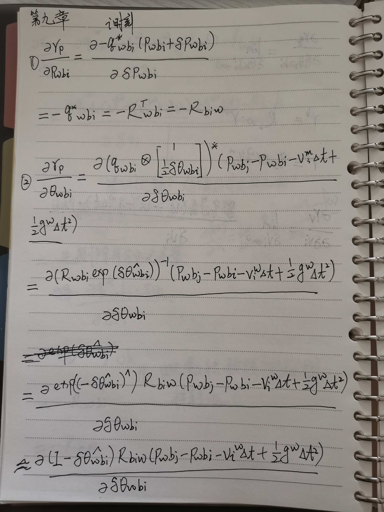
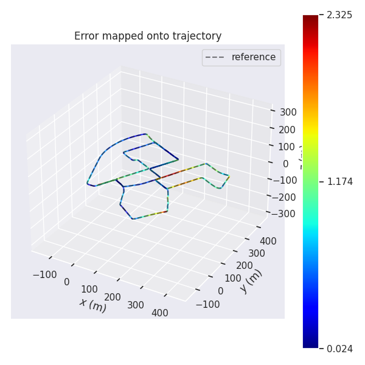
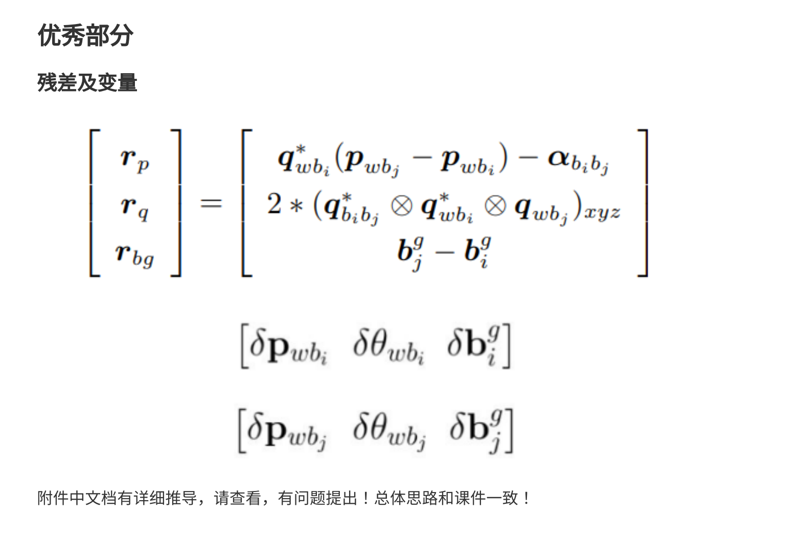
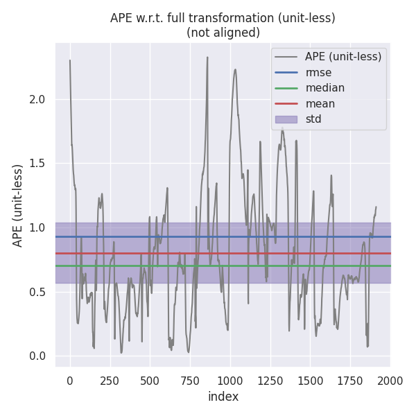
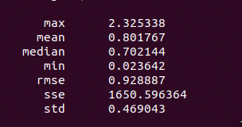
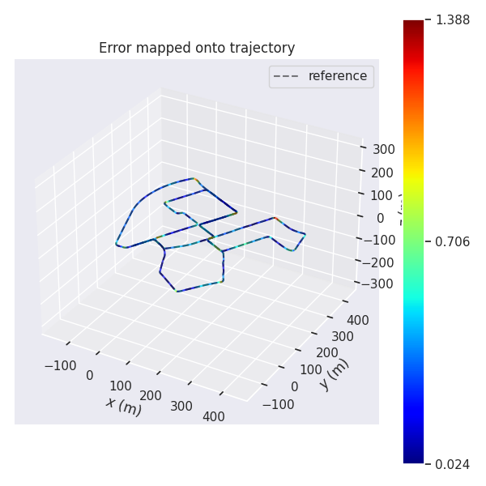
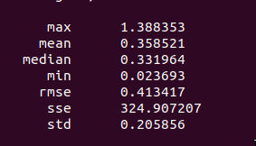

## 一、imu预积分残差雅克比矩阵

残差设计


<!-- $$
\begin{bmatrix}
    r_p \\
    r_q \\
    r_v \\
    r_{ba} \\
    r_{bg}
\end{bmatrix}
=

\begin{bmatrix}
    q^*_{wb_i}(p_{wb_j}-p_{wb_i}-v^w_i\Delta{t}+{1 \over 2}g^w\Delta{t^2})-\alpha_{b_ib_j}\\
    2[q^*_{b_ib_j}\otimes(q^*_{wb_i}\otimes q_{wb_j})]_{xyz} \\
    q^*_{wb_i}(v^w_j-v^w_i+g^w\Delta t)- \beta _{b_ib_j}   \\
    b^a_j - b^a_i \\
    b^g_j - b^g_i
\end{bmatrix}
$$ -->
<br> 

<!-- 对以下量求雅克比
$$[\delta p_{wb_i} \quad \delta \theta _{wb_i} \quad \delta v^w_i \quad \delta b^a_i \quad \delta b^g_i]$$
$$[\delta p_{wb_j} \quad \delta \theta _{wb_j} \quad \delta v^w_j \quad \delta b^a_j \quad \delta b^g_j]$$ -->

### 求偏导

<!-- ### 1 对$r_p$求偏导
   
对$\delta p_{wb_i}$
$$
{\partial r_p \over \delta p_{wb_i}} 
= {\partial - q^*_{wb_i}(p_{wb_i}+\delta p_{wb_i}) \over \partial \delta p_{wb_i}}
= - q^*_{wb_i}
= -R^T_{wb_i}
= -R_{b_iw}
$$

对$\delta \theta _{wb_i}$
$$

$$ -->

<table>
<tr>
  <td></td>
  <td> </td>
</tr>
<tr>
  <td></td>
  <td> </td>
</tr>
<tr>
  <td> </td>
  <td> </td>
</tr>
<tr>
  <td> </td>
  <td> </td>
</tr>
<tr>
  <td> </td>
  <td> </td>
</tr>
</table>

## 代码补全

```C++
// 1. get w_mid:
w_mid = 0.5 * (prev_w + curr_w);
// 2. update relative orientation, so3:
prev_theta_ij = state.theta_ij_;
d_theta_ij = Sophus::SO3d::exp(w_mid * T);
state.theta_ij_ = state.theta_ij_ * d_theta_ij;
curr_theta_ij = state.theta_ij_;

// 3. get a_mid:
a_mid = 0.5 * (prev_theta_ij * prev_a + curr_theta_ij * curr_a);
// 4. update relative translation:

state.alpha_ij_ += state.beta_ij_ * T + 0.5 * a_mid * T * T;
// 5. update relative velocity:
state.beta_ij_ += a_mid * T;

//
// TODO: b. update covariance:
//
// 1. intermediate results:
dR_inv = d_theta_ij.inverse().matrix();
prev_R = prev_theta_ij.matrix();
curr_R = curr_theta_ij.matrix();
prev_R_a_hat = prev_R * Sophus::SO3d::hat(prev_a);
curr_R_a_hat = curr_R * Sophus::SO3d::hat(curr_a);

//
// TODO: 2. set up F:
//
// F12 & F32:
F_.block<3, 3>(INDEX_ALPHA, INDEX_THETA) = -0.25 * T * (prev_R_a_hat + curr_R_a_hat * dR_inv); //  F12
F_.block<3, 3>(INDEX_BETA, INDEX_THETA) = -0.5 * T * (prev_R_a_hat + curr_R_a_hat * dR_inv);   //  F32

// F14 & F34:
F_.block<3, 3>(INDEX_ALPHA, INDEX_B_A) = -0.25 * T * (prev_R + curr_R); //  F14
F_.block<3, 3>(INDEX_BETA, INDEX_B_A) = -0.5 * (prev_R + curr_R);       //  F34

// F15 & F35:
F_.block<3, 3>(INDEX_ALPHA, INDEX_B_G) = 0.25 * T * T * curr_R_a_hat; //  F15
F_.block<3, 3>(INDEX_BETA, INDEX_B_G) = 0.5 * T * curr_R_a_hat;       // F35

// F22:
F_.block<3, 3>(INDEX_THETA, INDEX_THETA) = -Sophus::SO3d::hat(w_mid); //  F22
//
// TODO: 3. set up G:
//
// G11 & G31:
B_.block<3, 3>(INDEX_ALPHA, INDEX_M_ACC_PREV) = 0.25 * prev_R * T; //  G11
B_.block<3, 3>(INDEX_BETA, INDEX_M_ACC_PREV) = 0.5 * prev_R;       // G31

// G12 & G32:
B_.block<3, 3>(INDEX_ALPHA, INDEX_M_GYR_PREV) = -0.125 * T * T * curr_R_a_hat; // G12
B_.block<3, 3>(INDEX_BETA, INDEX_M_GYR_PREV) = -0.25 * T * curr_R_a_hat;       // G32

// G13 & G33:
B_.block<3, 3>(INDEX_ALPHA, INDEX_M_ACC_CURR) = 0.25 * curr_R * T; //  G13
B_.block<3, 3>(INDEX_BETA, INDEX_M_ACC_CURR) = 0.5 * curr_R;       //  G33

// G14 & G34:
B_.block<3, 3>(INDEX_ALPHA, INDEX_M_GYR_CURR) = -0.125 * T * T * curr_R_a_hat; // G14
B_.block<3, 3>(INDEX_BETA, INDEX_M_GYR_CURR) = -0.25 * T * curr_R_a_hat;       // G34

// TODO: 4. update P_:
MatrixF F = MatrixF::Identity() + T * F_;
MatrixB B = T * B_;
P_ = F * P_ * F.transpose() + B * Q_ * B.transpose();
//
// TODO: 5. update Jacobian:
//
J_ = F * J_;
```

```C++
//
// TODO: update pre-integration measurement caused by bias change:
//
if (v0->isUpdated()) {
    Eigen::Vector3d d_b_a_i, d_b_g_i;
    v0->getDeltaBiases(d_b_a_i, d_b_g_i);
    updateMeasurement(d_b_a_i, d_b_g_i);
}

//
// TODO: compute error:
//

// _error.block<3, 1>(INDEX_P, 0) = Eigen::Vector3d::Zero();
// _error.block<3, 1>(INDEX_R, 0) = Eigen::Vector3d::Zero();
// _error.block<3, 1>(INDEX_V, 0) = Eigen::Vector3d::Zero();
// _error.block<3, 1>(INDEX_A, 0) = Eigen::Vector3d::Zero();
// _error.block<3, 1>(INDEX_G, 0) = Eigen::Vector3d::Zero();
const Eigen::Vector3d &alpha_ij = _measurement.block<3, 1>(INDEX_P, 0);
const Eigen::Vector3d &theta_ij = _measurement.block<3, 1>(INDEX_R, 0);
const Eigen::Vector3d &beta_ij = _measurement.block<3, 1>(INDEX_V, 0);
_error.block<3, 1>(INDEX_P, 0) = ori_i.inverse().matrix() * (pos_j - pos_i - vel_i * T_ + 0.5 * g_ * T_ * T_) - alpha_ij;
_error.block<3, 1>(INDEX_R, 0) = (Sophus::SO3d::exp(theta_ij).inverse() * ori_i.inverse() * ori_j).log();
_error.block<3, 1>(INDEX_V, 0) = ori_i.inverse() * (vel_j - vel_i + g_ * T_) - beta_ij;
_error.block<3, 1>(INDEX_A, 0) = b_a_j - b_a_i;
_error.block<3, 1>(INDEX_G, 0) = b_g_j - b_g_i;
```

```C++
//
// TODO: do update
//
_estimate.pos += Eigen::Vector3d(
    update[PRVAG::INDEX_POS + 0], update[PRVAG::INDEX_POS + 1], update[PRVAG::INDEX_POS + 2]);
_estimate.ori = _estimate.ori * Sophus::SO3d::exp(
                                    Eigen::Vector3d(
                                        update[PRVAG::INDEX_ORI + 0], update[PRVAG::INDEX_ORI + 1], update[PRVAG::INDEX_ORI + 2]));
_estimate.vel += Eigen::Vector3d(
    update[PRVAG::INDEX_VEL + 0], update[PRVAG::INDEX_VEL + 1], update[PRVAG::INDEX_VEL + 2]);
Eigen::Vector3d d_b_a_i(
    update[PRVAG::INDEX_B_A + 0], update[PRVAG::INDEX_B_A + 1], update[PRVAG::INDEX_B_A + 2]);
Eigen::Vector3d d_b_g_i(
    update[PRVAG::INDEX_B_G + 0], update[PRVAG::INDEX_B_G + 1], update[PRVAG::INDEX_B_G + 2]);

_estimate.b_a += d_b_a_i;
_estimate.b_g += d_b_g_i;

updateDeltaBiases(d_b_a_i, d_b_g_i);
```

数据对比
```bash
evo_rpe kitti ground_truth.txt optimized.txt -r trans_part --delta 100 --plot --plot_mode xyz

evo_ape kitti ground_truth.txt optimized.txt -r full --plot --plot_mode xyz
```

|         | use_imu                                             | no_imu                                              |
| ------- | --------------------------------------------------- | --------------------------------------------------- |
| evo_ape |  |  |
|         |   |  |
|         |   |  |
| evo_rpe |   |  |
|         |   |  |
|         |   |  |

从结果来看，两种方式都差不多，但误差较大，怀疑是kitti数据问题